PC Parts Project - CPU Data EDA
================

-   [Introduction](#introduction)
-   [Data](#data)
    -   [Further Cleaning](#further-cleaning)
    -   [Relevant Variables](#relevant-variables)
-   [Exploratory Data Analysis](#exploratory-data-analysis)
    -   [Visualizations and Modeling](#visualizations-and-modeling)
        -   [Basic Plots](#basic-plots)
        -   [Single- and Multi-Threaded Performance Over Time
            (PassMark)](#single--and-multi-threaded-performance-over-time-passmark)
        -   [Regressing on PassMark and UserBenchmark
            Scores](#regressing-on-passmark-and-userbenchmark-scores)
    -   [Hypothesis Testing](#hypothesis-testing)
        -   [Performance Between Processor
            Classes](#performance-between-processor-classes)
        -   [Intel vs. AMD](#intel-vs-amd)
        -   [Is UserBenchmark Biased?](#is-userbenchmark-biased)
-   [Conclusion](#conclusion)

## Introduction

In this report, we will be performing basic exploratory data analysis on
data that has been scraped from PassMark and UserBenchmark for CPUs
released within the last few decades, which contains information on make
and performance for those processors.

We decided to pursue this project because of our shared interest in
computer hardware as well as the broader gaming and technology
industries. Moreover, we were curious about what kinds of data regarding
various PC parts we would be able to obtain from the Internet, the
process and challenges of obtaining them, and ultimately what insights
we as consumers could gain from that information.

## Data

The data sets that we will be examining are `cpu_cleaned.json`, which
contains descriptive and performance data for all CPUs listed on
PassMark at the time, and `cpu_userbenchmark_cleaned.json`, which
contains the data from PassMark merged with benchmark scores from
UserBenchmark for CPUs that are either desktop or laptop chips (server
chips and other miscellaneous ones were excluded due to lack of data on
UserBenchmark).

``` r
library(jsonlite)
passmark <- fromJSON("data/cpu_cleaned.json")
combined_filtered <- fromJSON("data/cpu_userbenchmark_cleaned.json")
```

Let’s take a look at the first few rows of each dataframe and their
respective structures.

``` r
head(passmark)
```

| name                    | base_clock | cores | threads | cpu_mark_overall_rank | cpu_mark_rating | cpu_mark_single_thread_rating | cpu_mark_cross_platform_rating | cpu_mark_samples | test_suite_integer_math | test_suite_floating_point_math | test_suite_find_prime_numbers | test_suite_random_string_sorting | test_suite_data_encryption | test_suite_data_compression | test_suite_physics | test_suite_extended_instructions | test_suite_single_thread | class  | socket | turbo_clock | tdp | release_quarter | old_cpu_mark_rating | old_cpu_mark_single_thread_rating |
|:------------------------|-----------:|------:|--------:|----------------------:|----------------:|------------------------------:|-------------------------------:|-----------------:|------------------------:|-------------------------------:|------------------------------:|---------------------------------:|---------------------------:|----------------------------:|-------------------:|---------------------------------:|-------------------------:|:-------|:-------|------------:|----:|----------------:|--------------------:|----------------------------------:|
| AArch64 rev 0 (aarch64) |        2.5 |     8 |       8 |                  1589 |            2499 |                          1048 |                           6694 |               25 |                   25705 |                           6224 |                            10 |                                8 |                      553.6 |                        53.0 |                214 |                             1018 |                     1048 | NA     | NA     |          NA |  NA |              NA |                  NA |                                NA |
| AArch64 rev 1 (aarch64) |     2362.0 |     8 |       8 |                  1666 |            2316 |                          1037 |                           6817 |               45 |                   24516 |                           6025 |                            10 |                                8 |                      493.3 |                        52.0 |                233 |                              832 |                     1037 | NA     | NA     |          NA |  NA |              NA |                  NA |                                NA |
| AArch64 rev 2 (aarch64) |        2.2 |     8 |       8 |                  1862 |            1956 |                           925 |                           5495 |               24 |                   22846 |                           5814 |                             7 |                                8 |                      430.0 |                        42.7 |                184 |                              766 |                      925 | NA     | NA     |          NA |  NA |              NA |                  NA |                                NA |
| AArch64 rev 4 (aarch64) |     2112.0 |     8 |       8 |                  2042 |            1658 |                           642 |                           3943 |               43 |                   24632 |                           3724 |                             5 |                                6 |                      473.1 |                        35.3 |                 92 |                              548 |                      642 | NA     | NA     |          NA |  NA |              NA |                  NA |                                NA |
| AC8257V/WAB             |     2001.0 |     8 |       8 |                  2805 |             693 |                           495 |                           1693 |                1 |                    8844 |                           1282 |                             2 |                                3 |                      205.5 |                        13.2 |                 53 |                              211 |                      495 | NA     | NA     |          NA |  NA |              NA |                  NA |                                NA |
| AMD 3015Ce              |        1.2 |     2 |       4 |                  2164 |            1474 |                          1391 |                           4192 |                1 |                   10231 |                           4968 |                             8 |                                3 |                      267.0 |                        32.0 |                151 |                              737 |                     1391 | Mobile | FT5    |         2.3 |   6 |              NA |                  NA |                                NA |

``` r
head(combined_filtered)
```

    ## Warning in `[<-.data.frame`(`*tmp*`, , j, value = structure(list(`Nov 20` =
    ## structure(c("0.00", : provided 72 variables to replace 1 variables

| name                    | class   | base_clock | turbo_clock | cores | threads | tdp | release_quarter | cpu_mark_overall_rank | cpu_mark_rating | cpu_mark_single_thread_rating | cpu_mark_cross_platform_rating | cpu_mark_samples | test_suite_integer_math | test_suite_floating_point_math | test_suite_find_prime_numbers | test_suite_random_string_sorting | test_suite_data_encryption | test_suite_data_compression | test_suite_physics | test_suite_extended_instructions | test_suite_single_thread | userbenchmark_score | userbenchmark_rank | userbenchmark_samples | userbenchmark_memory_latency | userbenchmark_1\_core | userbenchmark_2\_core | userbenchmark_4\_core | userbenchmark_8\_core | userbenchmark_64_core | userbenchmark_market_share | socket | old_cpu_mark_rating | old_cpu_mark_single_thread_rating | userbenchmark_efps |
|:------------------------|:--------|-----------:|------------:|------:|--------:|----:|----------------:|----------------------:|----------------:|------------------------------:|-------------------------------:|-----------------:|------------------------:|-------------------------------:|------------------------------:|---------------------------------:|---------------------------:|----------------------------:|-------------------:|---------------------------------:|-------------------------:|--------------------:|-------------------:|----------------------:|-----------------------------:|----------------------:|----------------------:|----------------------:|----------------------:|----------------------:|:---------------------------|:-------|--------------------:|----------------------------------:|-------------------:|
| AMD 3015e               | Laptop  |        1.2 |         2.3 |     2 |       4 |   6 |              54 |                  1530 |            2678 |                          1408 |                           4331 |                9 |                    9660 |                           4906 |                             8 |                                4 |                     2183.0 |                        30.6 |                170 |                             1211 |                     1408 |                30.6 |               1214 |                     9 |                         40.0 |                  52.5 |                  82.7 |                 124.0 |                 123.0 |                 124.0 | 0.00                       | NA     |                  NA |                                NA |                 NA |
| AMD 3020e               | Laptop  |        1.2 |         2.6 |     2 |       2 |   6 |              54 |                  1547 |            2611 |                          1472 |                           4647 |               45 |                    7072 |                           4594 |                            12 |                                4 |                     1585.0 |                        28.8 |                195 |                             1578 |                     1472 |                37.1 |               1058 |                   844 |                         52.4 |                  63.9 |                 125.0 |                 127.0 |                 131.0 |                 130.0 | 0.02                       | NA     |                  NA |                                NA |                 NA |
| AMD 4700S               | Desktop |        3.6 |         4.0 |     8 |      16 |  NA |              58 |                   240 |           18045 |                          2389 |                          27042 |                3 |                   64180 |                          30226 |                            43 |                               30 |                    13507.0 |                       263.6 |               1176 |                            12183 |                     2389 |                67.0 |                376 |                     3 |                         52.6 |                 117.0 |                 233.0 |                 435.0 |                 807.0 |                1204.0 | NA                         | NA     |                  NA |                                NA |                 NA |
| AMD A10 Micro-6700T APU | Laptop  |        1.2 |         2.2 |     4 |       4 |   5 |              34 |                  2277 |            1291 |                           703 |                             NA |                6 |                      NA |                             NA |                            NA |                               NA |                         NA |                          NA |                 NA |                               NA |                       NA |                24.9 |               1279 |                     7 |                         38.2 |                  25.1 |                  47.3 |                  67.3 |                  72.5 |                  69.3 | NA                         | FT3b   |                2067 |                               780 |                 NA |
| AMD A10 PRO-7350B APU   | Laptop  |        2.1 |         3.3 |     4 |       4 |  19 |              30 |                  1890 |            1910 |                           911 |                           4345 |              138 |                   11778 |                           3212 |                             9 |                                4 |                      507.8 |                        31.0 |                172 |                             1140 |                      911 |                34.2 |               1133 |                   852 |                         48.2 |                  40.1 |                  70.4 |                 119.0 |                 121.0 |                 121.0 | 0.00                       | FP3    |                2852 |                               916 |                 NA |
| AMD A10 PRO-7800B APU   | Desktop |        3.5 |         3.9 |     4 |       4 |  65 |              32 |                  1350 |            3194 |                          1497 |                           6343 |               25 |                   20003 |                           5528 |                            12 |                                6 |                      897.6 |                        53.9 |                214 |                             1990 |                     1497 |                  NA |                 NA |                    NA |                           NA |                    NA |                    NA |                    NA |                    NA |                    NA | NA                         | FM2+   |                4839 |                              1602 |                 NA |

``` r
str(passmark)
```

    ## 'data.frame':    3480 obs. of  25 variables:
    ##  $ name                             : chr  "AArch64 rev 0 (aarch64)" "AArch64 rev 1 (aarch64)" "AArch64 rev 2 (aarch64)" "AArch64 rev 4 (aarch64)" ...
    ##  $ base_clock                       : num  2.5 2362 2.2 2112 2001 ...
    ##  $ cores                            : int  8 8 8 8 8 2 2 2 8 4 ...
    ##  $ threads                          : int  8 8 8 8 8 4 4 2 16 4 ...
    ##  $ cpu_mark_overall_rank            : int  1589 1666 1862 2042 2805 2164 1531 1548 239 2278 ...
    ##  $ cpu_mark_rating                  : int  2499 2316 1956 1658 693 1474 2678 2611 18045 1291 ...
    ##  $ cpu_mark_single_thread_rating    : int  1048 1037 925 642 495 1391 1408 1472 2389 703 ...
    ##  $ cpu_mark_cross_platform_rating   : int  6694 6817 5495 3943 1693 4192 4331 4647 27042 NA ...
    ##  $ cpu_mark_samples                 : int  25 45 24 43 1 1 9 45 3 6 ...
    ##  $ test_suite_integer_math          : int  25705 24516 22846 24632 8844 10231 9660 7072 64180 NA ...
    ##  $ test_suite_floating_point_math   : int  6224 6025 5814 3724 1282 4968 4906 4594 30226 NA ...
    ##  $ test_suite_find_prime_numbers    : int  10 10 7 5 2 8 8 12 43 NA ...
    ##  $ test_suite_random_string_sorting : int  8 8 8 6 3 3 4 4 30 NA ...
    ##  $ test_suite_data_encryption       : num  554 493 430 473 206 ...
    ##  $ test_suite_data_compression      : num  53 52 42.7 35.3 13.2 ...
    ##  $ test_suite_physics               : int  214 233 184 92 53 151 170 195 1176 NA ...
    ##  $ test_suite_extended_instructions : int  1018 832 766 548 211 737 1211 1578 12183 NA ...
    ##  $ test_suite_single_thread         : int  1048 1037 925 642 495 1391 1408 1472 2389 NA ...
    ##  $ class                            : chr  NA NA NA NA ...
    ##  $ socket                           : chr  NA NA NA NA ...
    ##  $ turbo_clock                      : num  NA NA NA NA NA 2.3 2.3 2.6 4 2.2 ...
    ##  $ tdp                              : num  NA NA NA NA NA 6 6 6 NA 5 ...
    ##  $ release_quarter                  : int  NA NA NA NA NA NA 54 54 58 34 ...
    ##  $ old_cpu_mark_rating              : int  NA NA NA NA NA NA NA NA NA 2067 ...
    ##  $ old_cpu_mark_single_thread_rating: int  NA NA NA NA NA NA NA NA NA 780 ...

``` r
str(combined_filtered)
```

    ## 'data.frame':    2233 obs. of  36 variables:
    ##  $ name                             : chr  "AMD 3015e" "AMD 3020e" "AMD 4700S" "AMD A10 Micro-6700T APU" ...
    ##  $ class                            : chr  "Laptop" "Laptop" "Desktop" "Laptop" ...
    ##  $ base_clock                       : num  1.2 1.2 3.6 1.2 2.1 3.5 3.7 2.3 2 2.3 ...
    ##  $ turbo_clock                      : num  2.3 2.6 4 2.2 3.3 3.9 4 3.2 2.8 3.2 ...
    ##  $ cores                            : int  2 2 8 4 4 4 4 4 4 4 ...
    ##  $ threads                          : int  4 2 16 4 4 4 4 4 4 4 ...
    ##  $ tdp                              : num  6 6 NA 5 19 65 95 35 25 35 ...
    ##  $ release_quarter                  : int  54 54 58 34 30 32 32 22 22 26 ...
    ##  $ cpu_mark_overall_rank            : int  1530 1547 240 2277 1890 1350 1287 1902 2088 1976 ...
    ##  $ cpu_mark_rating                  : int  2678 2611 18045 1291 1910 3194 3406 1896 1606 1759 ...
    ##  $ cpu_mark_single_thread_rating    : int  1408 1472 2389 703 911 1497 1570 1067 884 940 ...
    ##  $ cpu_mark_cross_platform_rating   : int  4331 4647 27042 NA 4345 6343 7160 4573 3760 NA ...
    ##  $ cpu_mark_samples                 : int  9 45 3 6 138 25 14 1034 148 3 ...
    ##  $ test_suite_integer_math          : int  9660 7072 64180 NA 11778 20003 20703 12827 11173 NA ...
    ##  $ test_suite_floating_point_math   : int  4906 4594 30226 NA 3212 5528 5828 3486 2866 NA ...
    ##  $ test_suite_find_prime_numbers    : int  8 12 43 NA 9 12 13 9 7 NA ...
    ##  $ test_suite_random_string_sorting : int  4 4 30 NA 4 6 7 4 3 NA ...
    ##  $ test_suite_data_encryption       : num  2183 1585 13507 NA 508 ...
    ##  $ test_suite_data_compression      : num  30.6 28.8 263.6 NA 31 ...
    ##  $ test_suite_physics               : int  170 195 1176 NA 172 214 243 211 164 NA ...
    ##  $ test_suite_extended_instructions : int  1211 1578 12183 NA 1140 1990 2208 761 670 NA ...
    ##  $ test_suite_single_thread         : int  1408 1472 2389 NA 911 1497 1570 1067 884 NA ...
    ##  $ userbenchmark_score              : num  30.6 37.1 67 24.9 34.2 NA NA 44.6 38.5 46.2 ...
    ##  $ userbenchmark_rank               : int  1214 1058 376 1279 1133 NA NA 874 1014 842 ...
    ##  $ userbenchmark_samples            : int  9 844 3 7 852 NA NA 5111 1753 2 ...
    ##  $ userbenchmark_memory_latency     : num  40 52.4 52.6 38.2 48.2 NA NA 66.4 58.2 66.4 ...
    ##  $ userbenchmark_1_core             : num  52.5 63.9 117 25.1 40.1 NA NA 45.2 37.7 48.8 ...
    ##  $ userbenchmark_2_core             : num  82.7 125 233 47.3 70.4 NA NA 80.1 67.2 85.5 ...
    ##  $ userbenchmark_4_core             : num  124 127 435 67.3 119 NA NA 134 111 152 ...
    ##  $ userbenchmark_8_core             : num  123 131 807 72.5 121 NA NA 136 112 153 ...
    ##  $ userbenchmark_64_core            : num  124 130 1204 69.3 121 ...
    ##  $ userbenchmark_market_share       :'data.frame':   2233 obs. of  72 variables:
    ##   ..$ Nov 20: num  0 0.02 NA NA 0 NA NA 0.01 0 NA ...
    ##   ..$ Jun 20: num  NA 0 NA NA 0 NA NA 0.02 0.01 NA ...
    ##   ..$ Jul 20: num  NA 0 NA NA 0 NA NA 0.01 0.01 NA ...
    ##   ..$ Aug 20: num  NA 0 NA NA 0 NA NA 0.01 0 NA ...
    ##   ..$ Sep 20: num  NA 0.01 NA NA 0 NA NA 0.01 0.01 NA ...
    ##   ..$ Oct 20: num  NA 0.01 NA NA 0 NA NA 0.01 0.01 NA ...
    ##   ..$ Dec 20: num  NA 0.01 NA NA 0 NA NA 0.01 0 NA ...
    ##   ..$ Jan 21: num  NA 0.01 NA NA 0 NA NA 0.01 0.01 NA ...
    ##   ..$ Feb 21: num  NA 0.02 NA NA 0 NA NA 0.02 0 NA ...
    ##   ..$ Mar 21: num  NA 0.01 NA NA 0 NA NA 0.01 0 NA ...
    ##   ..$ Apr 21: num  NA 0.02 NA NA 0 NA NA 0.01 0.01 NA ...
    ##   ..$ May 21: num  NA 0.02 NA 0 0 NA NA 0.01 0 NA ...
    ##   ..$ Jun 21: num  NA 0.02 NA NA 0 NA NA 0.01 0 NA ...
    ##   ..$ Jul 21: num  NA 0.01 0 NA 0 NA NA 0.01 0 NA ...
    ##   ..$ Jan 20: num  NA NA NA NA 0.01 NA NA 0.02 0.01 NA ...
    ##   ..$ Feb 20: num  NA NA NA NA 0 NA NA 0.01 0.01 NA ...
    ##   ..$ Mar 20: num  NA NA NA NA 0 NA NA 0.02 0.01 NA ...
    ##   ..$ Apr 20: num  NA NA NA NA 0 NA NA 0.02 0.01 NA ...
    ##   ..$ May 20: num  NA NA NA NA 0 NA NA 0.02 0.01 NA ...
    ##   ..$ Dec 15: num  NA NA NA NA NA NA NA 0.1 0 NA ...
    ##   ..$ Jan 16: num  NA NA NA NA NA NA NA 0.1 0 NA ...
    ##   ..$ Feb 16: num  NA NA NA NA NA NA NA 0.1 0 NA ...
    ##   ..$ Mar 16: num  NA NA NA NA NA NA NA 0.1 0 NA ...
    ##   ..$ Apr 16: num  NA NA NA NA NA NA NA 0.1 0 NA ...
    ##   ..$ May 16: num  NA NA NA NA NA NA NA 0.1 NA NA ...
    ##   ..$ Jun 16: num  NA NA NA NA NA NA NA 0.06 NA NA ...
    ##   ..$ Jul 16: num  NA NA NA NA NA NA NA 0.07 NA NA ...
    ##   ..$ Aug 16: num  NA NA NA NA NA NA NA 0.05 NA NA ...
    ##   ..$ Sep 16: num  NA NA NA NA NA NA NA 0.04 0.02 NA ...
    ##   ..$ Oct 16: num  NA NA NA NA NA NA NA 0.05 0.02 NA ...
    ##   ..$ Nov 16: num  NA NA NA NA NA NA NA 0.05 0.01 NA ...
    ##   ..$ Dec 16: num  NA NA NA NA NA NA NA 0.04 0.01 NA ...
    ##   ..$ Jan 17: num  NA NA NA NA NA NA NA 0.03 0.01 NA ...
    ##   ..$ Feb 17: num  NA NA NA NA NA NA NA 0.04 0.01 NA ...
    ##   ..$ Mar 17: num  NA NA NA NA NA NA NA 0.03 0.01 NA ...
    ##   ..$ Apr 17: num  NA NA NA NA NA NA NA 0.04 0.01 NA ...
    ##   ..$ May 17: num  NA NA NA NA NA NA NA 0.04 0.01 NA ...
    ##   ..$ Jun 17: num  NA NA NA NA NA NA NA 0.04 0.02 NA ...
    ##   ..$ Jul 17: num  NA NA NA NA NA NA NA 0.03 0.01 NA ...
    ##   ..$ Aug 17: num  NA NA NA NA NA NA NA 0.04 0.01 NA ...
    ##   ..$ Sep 17: num  NA NA NA NA NA NA NA 0.04 0.01 NA ...
    ##   ..$ Oct 17: num  NA NA NA NA NA NA NA 0.03 0.01 NA ...
    ##   ..$ Nov 17: num  NA NA NA NA NA NA NA 0.03 0.02 NA ...
    ##   ..$ Dec 17: num  NA NA NA NA NA NA NA 0.03 0.01 NA ...
    ##   ..$ Jan 18: num  NA NA NA NA NA NA NA 0.03 0.01 NA ...
    ##   ..$ Feb 18: num  NA NA NA NA NA NA NA 0.03 0.01 NA ...
    ##   ..$ Mar 18: num  NA NA NA NA NA NA NA 0.03 0.01 NA ...
    ##   ..$ Apr 18: num  NA NA NA NA NA NA NA 0.03 0.01 NA ...
    ##   ..$ May 18: num  NA NA NA NA NA NA NA 0.03 0.01 NA ...
    ##   ..$ Jun 18: num  NA NA NA NA NA NA NA 0.02 0.01 NA ...
    ##   ..$ Jul 18: num  NA NA NA NA NA NA NA 0.03 0.01 NA ...
    ##   ..$ Aug 18: num  NA NA NA NA NA NA NA NA 0.01 NA ...
    ##   ..$ Sep 18: num  NA NA NA NA NA NA NA NA NA NA ...
    ##   ..$ Oct 18: num  NA NA NA NA NA NA NA NA NA NA ...
    ##   ..$ Nov 18: num  NA NA NA NA NA NA NA NA NA NA ...
    ##   ..$ Dec 18: num  NA NA NA NA NA NA NA NA NA NA ...
    ##   ..$ Jan 19: num  NA NA NA NA NA NA NA NA NA NA ...
    ##   ..$ Feb 19: num  NA NA NA NA NA NA NA NA NA NA ...
    ##   ..$ Mar 19: num  NA NA NA NA NA NA NA NA NA NA ...
    ##   ..$ Apr 19: num  NA NA NA NA NA NA NA NA NA NA ...
    ##   ..$ May 19: num  NA NA NA NA NA NA NA NA NA NA ...
    ##   ..$ Jun 19: num  NA NA NA NA NA NA NA NA NA NA ...
    ##   ..$ Jul 19: num  NA NA NA NA NA NA NA NA NA NA ...
    ##   ..$ Aug 19: num  NA NA NA NA NA NA NA NA NA NA ...
    ##   ..$ Sep 19: num  NA NA NA NA NA NA NA NA NA NA ...
    ##   ..$ Oct 19: num  NA NA NA NA NA NA NA NA NA NA ...
    ##   ..$ Nov 19: num  NA NA NA NA NA NA NA NA NA NA ...
    ##   ..$ Dec 19: num  NA NA NA NA NA NA NA NA NA NA ...
    ##   ..$ Mar 15: int  NA NA NA NA NA NA NA NA NA NA ...
    ##   ..$ Aug 15: int  NA NA NA NA NA NA NA NA NA NA ...
    ##   ..$ Sep 15: int  NA NA NA NA NA NA NA NA NA NA ...
    ##   ..$ Nov 15: int  NA NA NA NA NA NA NA NA NA NA ...
    ##  $ socket                           : chr  NA NA NA "FT3b" ...
    ##  $ old_cpu_mark_rating              : int  NA NA NA 2067 2852 4839 5070 3192 2695 NA ...
    ##  $ old_cpu_mark_single_thread_rating: int  NA NA NA 780 916 1602 1674 1019 886 NA ...
    ##  $ userbenchmark_efps               : int  NA NA NA NA NA NA NA NA NA NA ...

### Further Cleaning

The majority of data cleaning and formatting was incorporated into the
original scraper in `index.js`, but there are some fields that are not
needed and can be removed.

The variables `old_cpu_mark_rating` and
`old_cpu_mark_single_thread_rating` represent outdated information, so
they are extraneous.

We also notice that the `userbenchmark_market_share` variable in
`combined_filtered` is a nested dataframe; furthermore, it will be
irrelevant for this analysis, so we can also drop the column.

``` r
passmark <- subset(passmark, select = -c(old_cpu_mark_rating, old_cpu_mark_single_thread_rating, cpu_mark_cross_platform_rating))
combined_filtered <- subset(combined_filtered, select = -c(old_cpu_mark_rating, old_cpu_mark_single_thread_rating, userbenchmark_market_share, cpu_mark_cross_platform_rating))

str(passmark)
```

    ## 'data.frame':    3480 obs. of  22 variables:
    ##  $ name                            : chr  "AArch64 rev 0 (aarch64)" "AArch64 rev 1 (aarch64)" "AArch64 rev 2 (aarch64)" "AArch64 rev 4 (aarch64)" ...
    ##  $ base_clock                      : num  2.5 2362 2.2 2112 2001 ...
    ##  $ cores                           : int  8 8 8 8 8 2 2 2 8 4 ...
    ##  $ threads                         : int  8 8 8 8 8 4 4 2 16 4 ...
    ##  $ cpu_mark_overall_rank           : int  1589 1666 1862 2042 2805 2164 1531 1548 239 2278 ...
    ##  $ cpu_mark_rating                 : int  2499 2316 1956 1658 693 1474 2678 2611 18045 1291 ...
    ##  $ cpu_mark_single_thread_rating   : int  1048 1037 925 642 495 1391 1408 1472 2389 703 ...
    ##  $ cpu_mark_samples                : int  25 45 24 43 1 1 9 45 3 6 ...
    ##  $ test_suite_integer_math         : int  25705 24516 22846 24632 8844 10231 9660 7072 64180 NA ...
    ##  $ test_suite_floating_point_math  : int  6224 6025 5814 3724 1282 4968 4906 4594 30226 NA ...
    ##  $ test_suite_find_prime_numbers   : int  10 10 7 5 2 8 8 12 43 NA ...
    ##  $ test_suite_random_string_sorting: int  8 8 8 6 3 3 4 4 30 NA ...
    ##  $ test_suite_data_encryption      : num  554 493 430 473 206 ...
    ##  $ test_suite_data_compression     : num  53 52 42.7 35.3 13.2 ...
    ##  $ test_suite_physics              : int  214 233 184 92 53 151 170 195 1176 NA ...
    ##  $ test_suite_extended_instructions: int  1018 832 766 548 211 737 1211 1578 12183 NA ...
    ##  $ test_suite_single_thread        : int  1048 1037 925 642 495 1391 1408 1472 2389 NA ...
    ##  $ class                           : chr  NA NA NA NA ...
    ##  $ socket                          : chr  NA NA NA NA ...
    ##  $ turbo_clock                     : num  NA NA NA NA NA 2.3 2.3 2.6 4 2.2 ...
    ##  $ tdp                             : num  NA NA NA NA NA 6 6 6 NA 5 ...
    ##  $ release_quarter                 : int  NA NA NA NA NA NA 54 54 58 34 ...

``` r
str(combined_filtered)
```

    ## 'data.frame':    2233 obs. of  32 variables:
    ##  $ name                            : chr  "AMD 3015e" "AMD 3020e" "AMD 4700S" "AMD A10 Micro-6700T APU" ...
    ##  $ class                           : chr  "Laptop" "Laptop" "Desktop" "Laptop" ...
    ##  $ base_clock                      : num  1.2 1.2 3.6 1.2 2.1 3.5 3.7 2.3 2 2.3 ...
    ##  $ turbo_clock                     : num  2.3 2.6 4 2.2 3.3 3.9 4 3.2 2.8 3.2 ...
    ##  $ cores                           : int  2 2 8 4 4 4 4 4 4 4 ...
    ##  $ threads                         : int  4 2 16 4 4 4 4 4 4 4 ...
    ##  $ tdp                             : num  6 6 NA 5 19 65 95 35 25 35 ...
    ##  $ release_quarter                 : int  54 54 58 34 30 32 32 22 22 26 ...
    ##  $ cpu_mark_overall_rank           : int  1530 1547 240 2277 1890 1350 1287 1902 2088 1976 ...
    ##  $ cpu_mark_rating                 : int  2678 2611 18045 1291 1910 3194 3406 1896 1606 1759 ...
    ##  $ cpu_mark_single_thread_rating   : int  1408 1472 2389 703 911 1497 1570 1067 884 940 ...
    ##  $ cpu_mark_samples                : int  9 45 3 6 138 25 14 1034 148 3 ...
    ##  $ test_suite_integer_math         : int  9660 7072 64180 NA 11778 20003 20703 12827 11173 NA ...
    ##  $ test_suite_floating_point_math  : int  4906 4594 30226 NA 3212 5528 5828 3486 2866 NA ...
    ##  $ test_suite_find_prime_numbers   : int  8 12 43 NA 9 12 13 9 7 NA ...
    ##  $ test_suite_random_string_sorting: int  4 4 30 NA 4 6 7 4 3 NA ...
    ##  $ test_suite_data_encryption      : num  2183 1585 13507 NA 508 ...
    ##  $ test_suite_data_compression     : num  30.6 28.8 263.6 NA 31 ...
    ##  $ test_suite_physics              : int  170 195 1176 NA 172 214 243 211 164 NA ...
    ##  $ test_suite_extended_instructions: int  1211 1578 12183 NA 1140 1990 2208 761 670 NA ...
    ##  $ test_suite_single_thread        : int  1408 1472 2389 NA 911 1497 1570 1067 884 NA ...
    ##  $ userbenchmark_score             : num  30.6 37.1 67 24.9 34.2 NA NA 44.6 38.5 46.2 ...
    ##  $ userbenchmark_rank              : int  1214 1058 376 1279 1133 NA NA 874 1014 842 ...
    ##  $ userbenchmark_samples           : int  9 844 3 7 852 NA NA 5111 1753 2 ...
    ##  $ userbenchmark_memory_latency    : num  40 52.4 52.6 38.2 48.2 NA NA 66.4 58.2 66.4 ...
    ##  $ userbenchmark_1_core            : num  52.5 63.9 117 25.1 40.1 NA NA 45.2 37.7 48.8 ...
    ##  $ userbenchmark_2_core            : num  82.7 125 233 47.3 70.4 NA NA 80.1 67.2 85.5 ...
    ##  $ userbenchmark_4_core            : num  124 127 435 67.3 119 NA NA 134 111 152 ...
    ##  $ userbenchmark_8_core            : num  123 131 807 72.5 121 NA NA 136 112 153 ...
    ##  $ userbenchmark_64_core           : num  124 130 1204 69.3 121 ...
    ##  $ socket                          : chr  NA NA NA "FT3b" ...
    ##  $ userbenchmark_efps              : int  NA NA NA NA NA NA NA NA NA NA ...

Moreover, some of the base clock speeds are in Hz.

``` r
passmark$base_clock = ifelse(passmark$base_clock > 100, 
                             passmark$base_clock / 1000, passmark$base_clock)
passmark$turbo_clock = ifelse(passmark$turbo_clock > 10, 
                              passmark$turbo_clock / 10, passmark$turbo_clock)

combined_filtered$base_clock = ifelse(combined_filtered$base_clock > 100, 
                             combined_filtered$base_clock / 1000, combined_filtered$base_clock)
combined_filtered$turbo_clock = ifelse(combined_filtered$turbo_clock > 10, 
                              combined_filtered$turbo_clock / 10, combined_filtered$turbo_clock)
```

### Relevant Variables

Since the columns in `passmark` are included in `combined_filtered`, I
will reference the variables in `combined_filtered`. The relevant
variables and their descriptions are as follows:

-   name
    -   The name of the processor
-   class
    -   The type of processor (desktop, laptop, mobile, server)
-   base_clock
    -   Base clock frequency, measured in GHz
-   turbo_clock
    -   Boost clock frequency, measured in GHz
-   cores
    -   Number of cores
-   threads
    -   Number of threads (will always be either 1x or 2x number of
        cores)
-   tdp
    -   Thermal design power, measured in watts
-   release_quarter
    -   Fiscal quarter that the CPU was released, with 1 = Q1 2007
-   cpu_mark_overall_rank
    -   Ranking of the CPU with respect to PassMark score
-   cpu_mark_rating
    -   Overall PassMark benchmark score
-   cpu_mark_single_thread_rating
    -   Single-threaded Passmark benchmark score
-   cpu_mark_samples
    -   Number of samples

The following are different metrics tested in PassMark’s performance
test and the corresponding scores, measured typically in millions of
operations per second:

-   test_suite_integer_math
-   test_suite_floating_point_math
-   test_suite_find_prime_numbers
-   test_suite_random_string_sorting
-   test_suite_data_encryption
-   test_suite_data_compression
-   test_suite_physics
-   test_suite_extended_instructions
-   test_suite_single_thread

Continuing,

-   userbenchmark_score
    -   UserBenchmark score, measured as a percentile relative to the
        Intel i9-9900K which approximately represents 100%
-   userbenchmark_rank
    -   Ranking of the CPU with respect to UserBenchmark score
-   userbenchmark_samples
    -   Number of samples
-   userbenchmark_memory_latency
    -   Score assigned to CPU memory latency
-   userbenchmark_1\_core
    -   Single core mixed CPU speed score
-   userbenchmark_2\_core
    -   Dual core mixed CPU speed score
-   userbenchmark_4\_core
    -   Quad core mixed CPU speed score
-   userbenchmark_8\_core
    -   Octa core mixed CPU speed score
-   userbenchmark_64_core
    -   Multi core mixed CPU speed score
-   socket
    -   Type of socket used on motherboard
-   userbenchmark_efps
    -   Average effective frames per second across multiple popular
        video games

## Exploratory Data Analysis

### Visualizations and Modeling

#### Basic Plots

``` r
# Create brand variable
passmark$brand = ifelse(substr(passmark$name, 1, 3) == "AMD", "AMD", 
                        ifelse(substr(passmark$name, 1, 5) == "Intel", 
                               "Intel", "Other"))
combined_filtered$brand = ifelse(substr(combined_filtered$name, 1, 3) == "AMD", "AMD", 
                                 ifelse(substr(combined_filtered$name, 1, 5) == "Intel", 
                                        "Intel", "Other"))

# Bar chart of brands
tbl <- with(passmark, table(brand))
barplot(tbl, main = "CPU Brand Distribution", 
        xlab = "Brand", ylab = "Count", col = c("red", "blue", "green"))
```

<!-- -->

``` r
# Bar chart of class
tbl2 <- with(passmark, table(class))
barplot(tbl2, main = "CPU Class Distribution", 
        xlab = "Class", ylab = "Count")
```

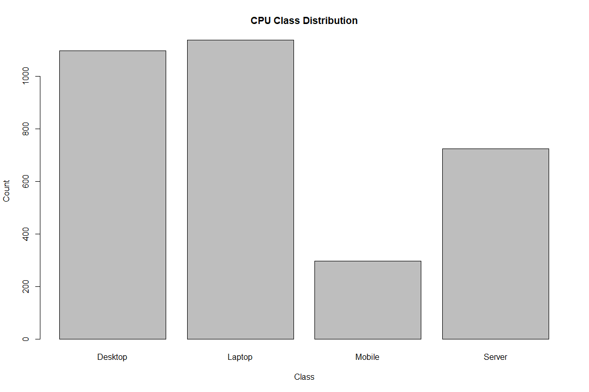<!-- -->

``` r
# Boxplots for base and turbo clock speeds
boxplot(passmark[, c("base_clock", "turbo_clock")], 
        main = "Base and Turbo Clock Speeds", 
        names = c("Base", "Turbo"), ylab = "Speed (GHz)")
```

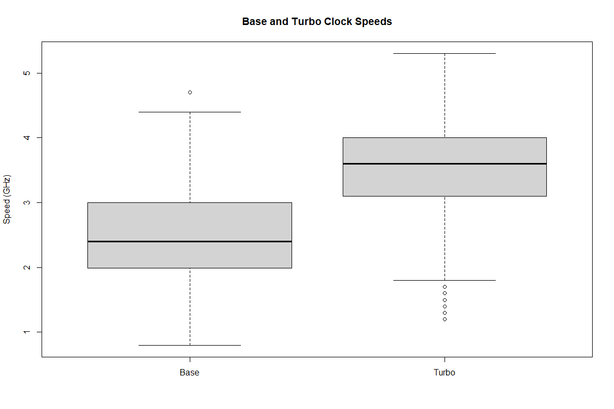<!-- -->

``` r
# Boxplots for numbers of cores and threads
boxplot(passmark[, c("cores", "threads")], 
        main = "Numbers of Cores and Threads", 
        names = c("Cores", "Threads"), ylab = "Count")
```

<!-- -->

``` r
# Histogram of TDP
hist(passmark$tdp, main = "Histogram of TDPs", 
     xlab = "TDP (watts)")
```

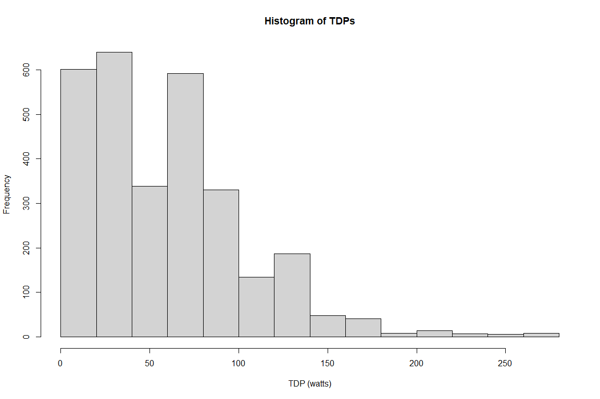<!-- -->

``` r
# Plot of CPUs released over time by quarter
library(zoo)
```

    ## 
    ## Attaching package: 'zoo'

    ## The following objects are masked from 'package:base':
    ## 
    ##     as.Date, as.Date.numeric

``` r
passmark$yearqtr = as.yearqtr(2007 + (passmark$release_quarter - 1) / 4)
combined_filtered$yearqtr = as.yearqtr(2007 + (combined_filtered$release_quarter - 1) / 4)
tbl2 <- with(passmark, table(yearqtr))
plot(tbl2, main = "Number of Processors Per Quarter", 
     xlab = "Year Quarter", ylab = "Count")
```

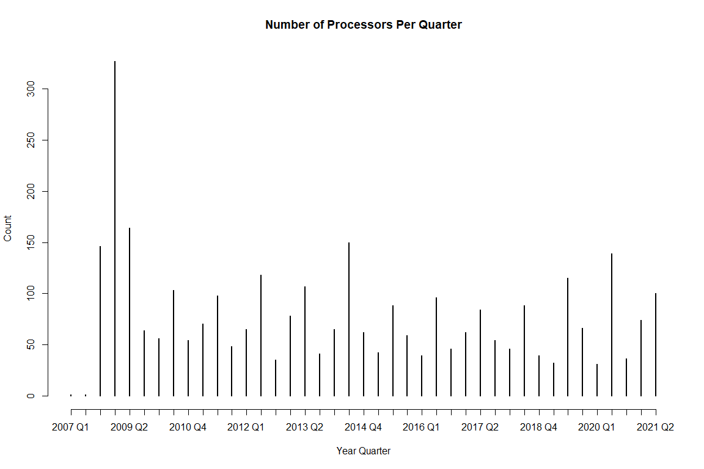<!-- -->

``` r
# Histogram of benchmark scores
hist(passmark$cpu_mark_rating, 
     main = "Histogram of PassMark Scores", xlab = "Score")
```

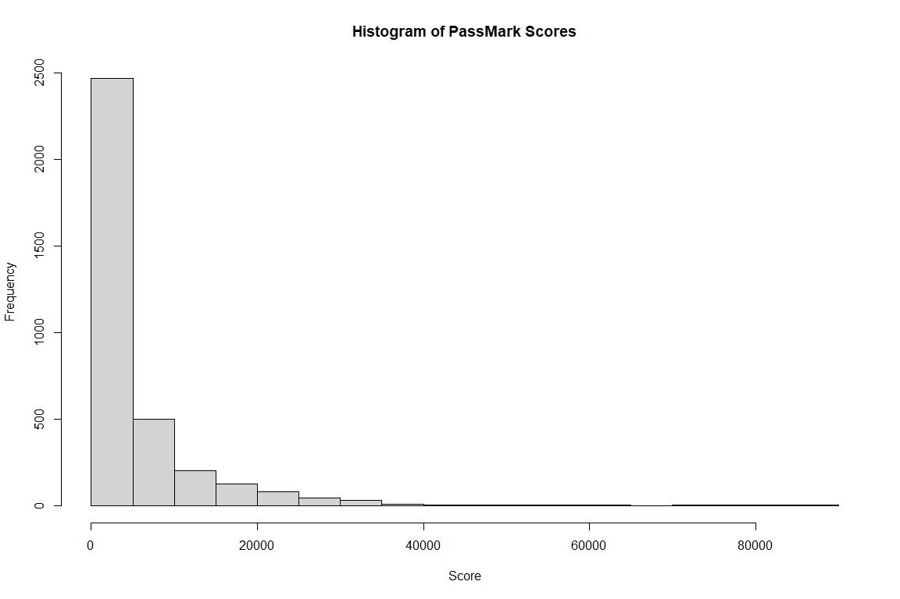<!-- -->

``` r
hist(combined_filtered$userbenchmark_score, 
     main = "Histogram of UserBenchmark Scores", 
     xlab = "Score")
```

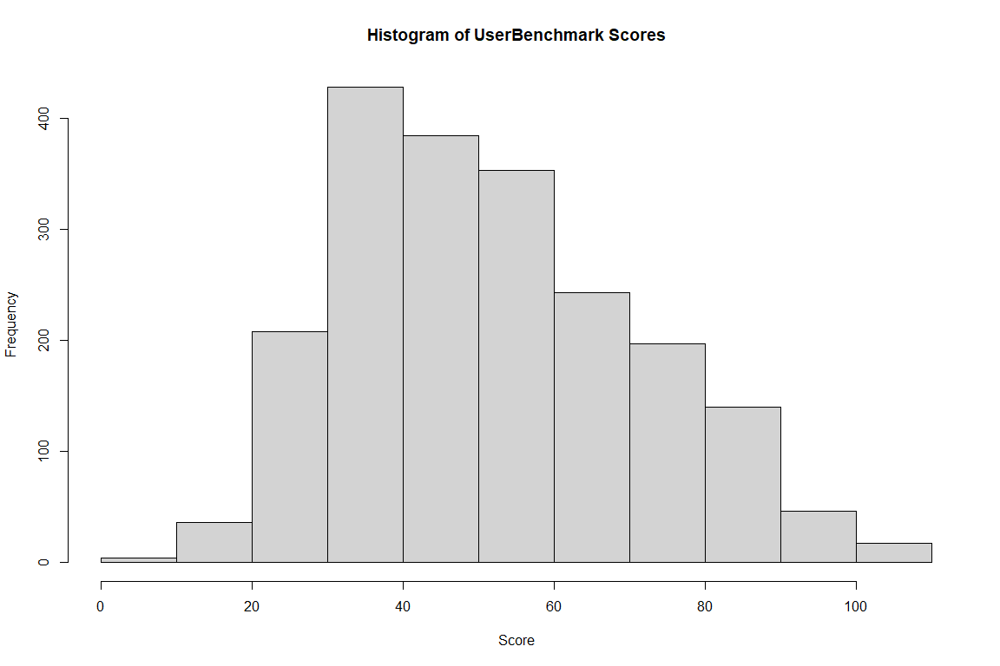<!-- -->

``` r
# Bar chart of socket types and respective counts
tbl3 <- with(passmark, table(socket))
sockets <- sort(tbl3, decreasing = T)
sockets <- head(sockets, 5)

barplot(sockets, main = "Top 5 CPU Sockets", xlab = "Socket", 
        ylab = "Count")
```

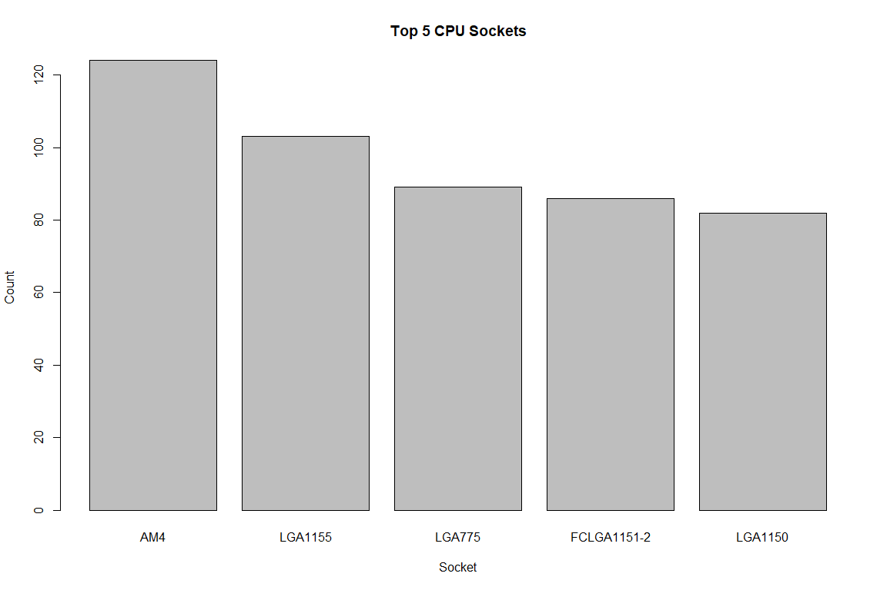<!-- -->

#### Single- and Multi-Threaded Performance Over Time (PassMark)

I want to examine how overall and single thread performance has changed
over time. One way of displaying these improvements is plotting maximum
scores for the CPUs in each release quarter. Plotting mean or median
scores wouldn’t make much sense since most CPUs are created for average
consumers.

In order to do this, I need to create a new dataframe that takes
`passmark`, groups by release quarter, and finds both maximum scores.

``` r
result <- aggregate(cbind(cpu_mark_rating, cpu_mark_single_thread_rating) ~ yearqtr, data = passmark, max)

head(result)
```

| yearqtr | cpu_mark_rating | cpu_mark_single_thread_rating |
|:--------|----------------:|------------------------------:|
| 2007 Q1 |            1678 |                           827 |
| 2008 Q1 |            2705 |                          1446 |
| 2008 Q4 |            3288 |                          1452 |
| 2009 Q1 |            3386 |                          1503 |
| 2009 Q2 |            3354 |                          1571 |
| 2009 Q4 |            3471 |                          1546 |

Let’s first look at overall performance.

``` r
library(ggplot2)
ggplot(result, aes(x = yearqtr, y = cpu_mark_rating)) + geom_point(color = "blue")
```

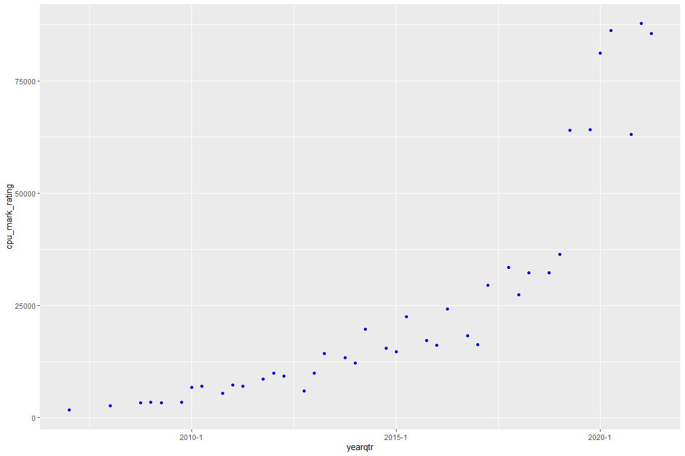<!-- -->

There appears to be a strong, positive exponential relationship. This
makes sense as these overall scores reflect multi-threaded performance,
and CPUs are being designed with increasing numbers of cores and there
have been improvements in multi-threading technologies like Intel’s
Hyper-Threading and AMD’s Simultaneous Multi-Threading.

Next, let’s look at single thread performance.

``` r
ggplot(result, aes(x = yearqtr, y = cpu_mark_single_thread_rating)) + geom_point(color = "red")
```

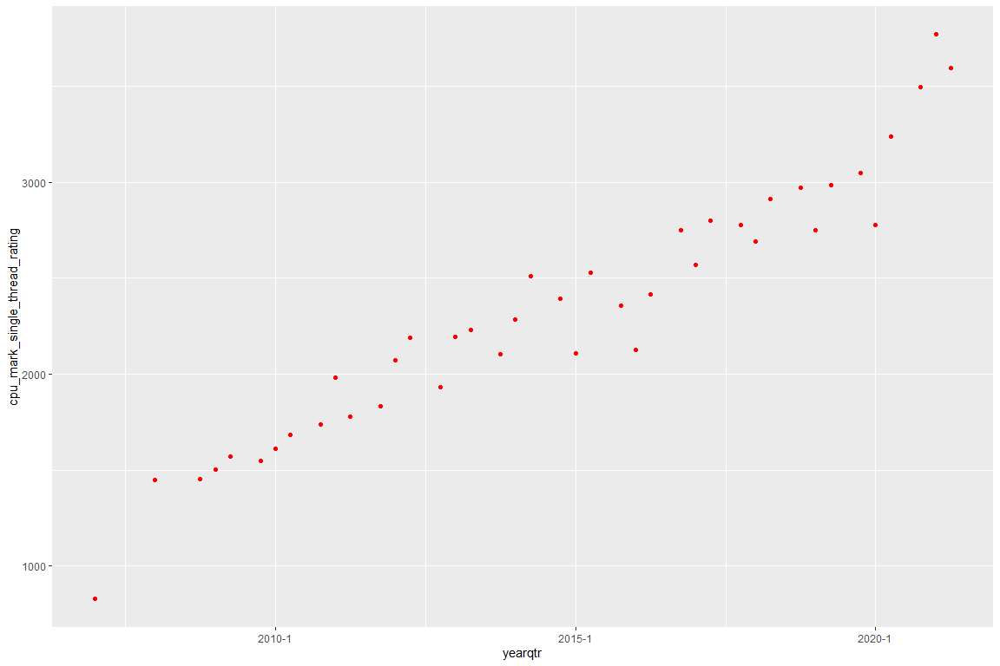<!-- -->

There does seem to be a moderately strong positive linear association
between time passed and single thread performance of the best CPUs of
each quarter. This makes sense as single thread performance is largely
dictated by the CPU’s frequency, number of transistors, power draw, and
thermal stability. Improvements in each of these have been fairly slow
yet steady, and the data appears to reflect these changes in increasing
single thread performance.

However, an issue with using a linear model specifically for predicting
single thread performance is that it is bottlenecked by physical and
technological capabilities. There can only be so many transistors that
fit on the face of a processor, and how high a clock speed can be pushed
is limited by the cooling required to compensate for higher power draw.
In other words, it is likely that the rate of increase in single thread
performance will slow down, but with the given data this cannot be
properly reflected.

To create an exponential model for overall performance, I perform a
least-squares regression with the natural logarithm of `cpu_mark_rating`
and `yearqtr`.

``` r
p1_model <- lm(log(cpu_mark_rating) ~ yearqtr, data = result)
```

Next, I calculate the 95% prediction intervals for the model.

``` r
library(dplyr)
```

    ## 
    ## Attaching package: 'dplyr'

    ## The following objects are masked from 'package:stats':
    ## 
    ##     filter, lag

    ## The following objects are masked from 'package:base':
    ## 
    ##     intersect, setdiff, setequal, union

``` r
p1_pred_int <- predict(p1_model, interval = "prediction", level = 0.95)
```

    ## Warning in predict.lm(p1_model, interval = "prediction", level = 0.95): predictions on current data refer to _future_ responses

``` r
reg1 <- data.frame(cbind(result$yearqtr, result$cpu_mark_rating, exp(p1_pred_int)))
reg1 <- reg1 %>%
  rename(
    yearqtr = V1,
    cpu_mark_rating = V2
  )
```

Plotting the regression model and the prediction interval yields:

``` r
ggplot(reg1, aes(x = yearqtr, y = cpu_mark_rating)) + geom_point(color = "blue") + geom_line(aes(y = lwr), color = "black", linetype = "dashed") + geom_line(aes(y = upr), color = "black", linetype = "dashed") + geom_line(aes(y = fit), color = "orange")
```

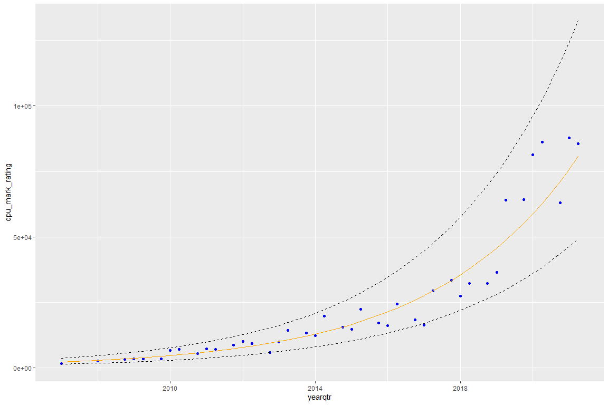<!-- -->

To check if this is an appropriate model, we examine the associated
residual plot:

``` r
res1 <- resid(p1_model)
plot(reg1$yearqtr, res1)
abline(0, 0)
```

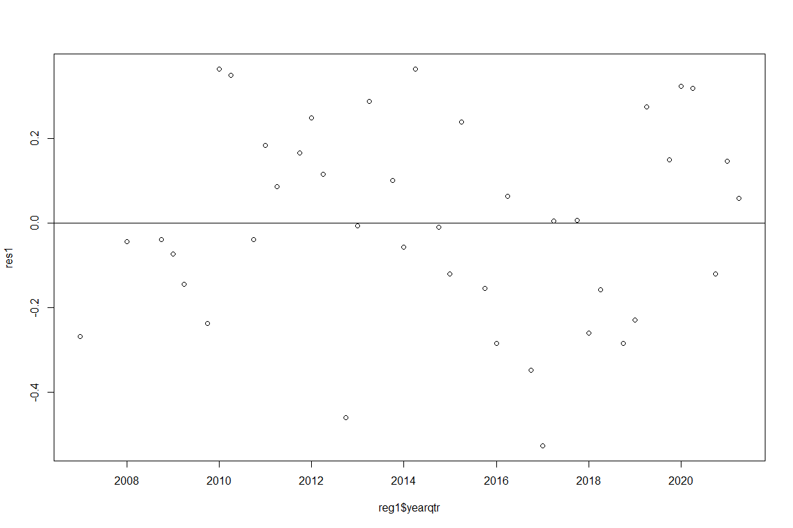<!-- -->

This process will be repeated for single thread performance, except with
the use of a simple linear model.

``` r
p2_model <- lm(cpu_mark_single_thread_rating ~ yearqtr, data = result)
p2_pred_int <- predict(p2_model, interval = "prediction", level = 0.95)
```

    ## Warning in predict.lm(p2_model, interval = "prediction", level = 0.95): predictions on current data refer to _future_ responses

``` r
reg2 <- data.frame(cbind(result$yearqtr, result$cpu_mark_single_thread_rating, p2_pred_int))
reg2 <- reg2 %>%
  rename(
    yearqtr = V1,
    cpu_mark_single_thread_rating = V2
  )

ggplot(reg2, aes(x = yearqtr, y = cpu_mark_single_thread_rating)) + geom_point(color = "red") + geom_line(aes(y = lwr), color = "black", linetype = "dashed") + geom_line(aes(y = upr), color = "black", linetype = "dashed") + geom_line(aes(y = fit), color = "green")
```

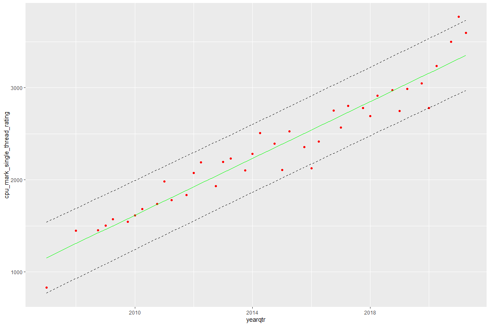<!-- -->

``` r
res2 <- resid(p2_model)
plot(reg2$yearqtr, res2)
abline(0, 0)
```

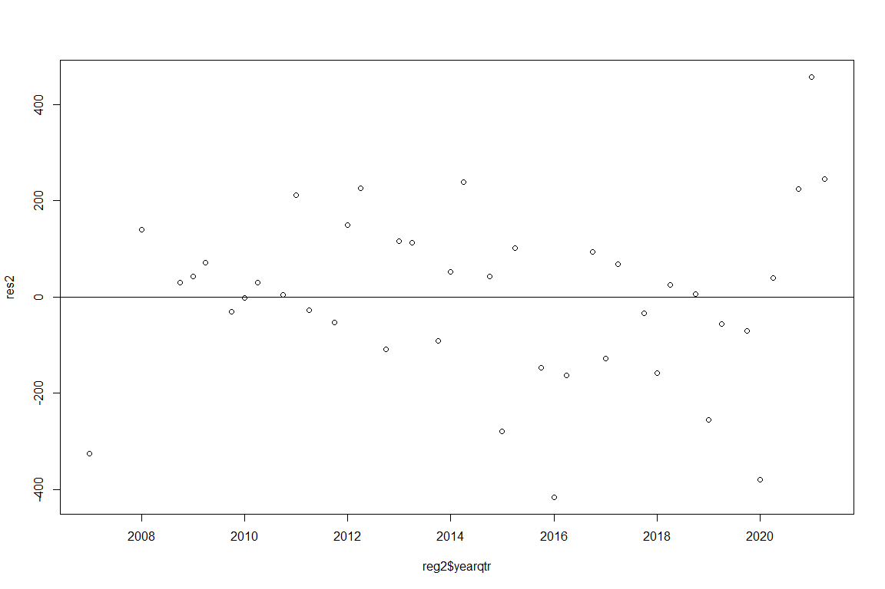<!-- -->

#### Regressing on PassMark and UserBenchmark Scores

As consumers, it’s important to get an understanding of how different
benchmark platforms come up with their scores as well as the features of
a CPU that influence those scores.

To begin, we would like to examine what variables are correlated with
PassMark’s `cpu_mark_rating`. We start by logically choosing the
variables that would make sense to have an effect on the overall score:

-   base_clock
-   turbo_clock
-   cores
-   threads
-   tdp
-   release_quarter
-   cpu_mark_samples

Earlier, we saw that the distribution of `cpu_mark_rating` is heavily
right skewed, so we might want to try a log transformation.

``` r
# Apply log transform
passmark$log_cpu_mark_rating <- log(passmark$cpu_mark_rating)

# Check resulting distribution
boxplot(passmark$log_cpu_mark_rating, main = "Distribution of Log-Transformed PassMark Overall Scores", col = "light blue")
```

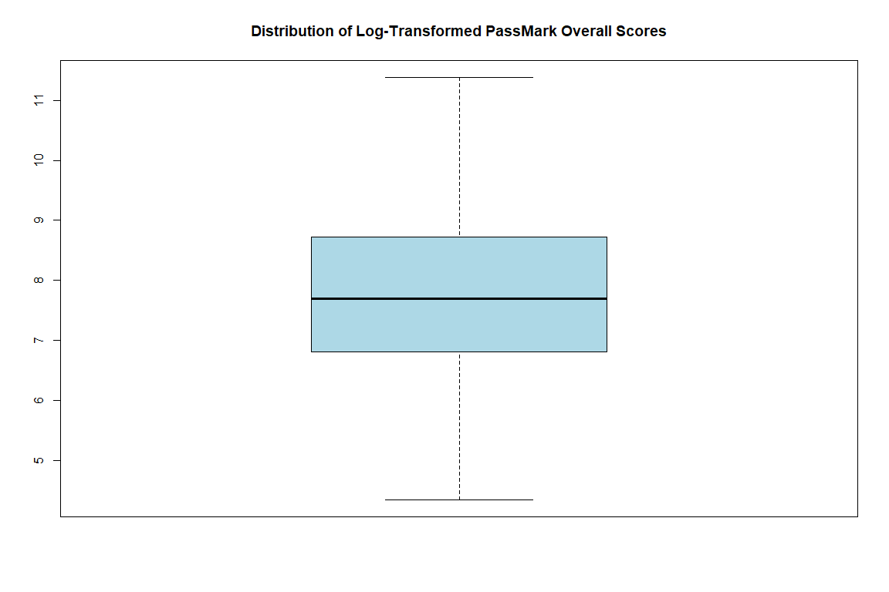<!-- -->

``` r
hist(passmark$log_cpu_mark_rating, main = "Distribution of Log-Transformed PassMark Overall Scores", col = "light blue")
```

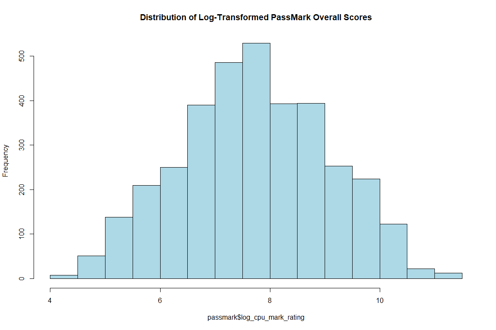<!-- -->

Let’s create a subset of `passmark` with the relevant variables.

``` r
passmark2 <- passmark[, c("log_cpu_mark_rating", "base_clock", 
                          "turbo_clock", "cores", "threads", "tdp", 
                          "release_quarter", "cpu_mark_samples")]
```

To visualize the relationships between the variables, correlation plots
will be created.

``` r
library(corrplot)
```

    ## corrplot 0.92 loaded

``` r
sigcorr <- cor.mtest(passmark2, conf.level = .95)
corrplot.mixed(cor(passmark2, use="pairwise.complete.obs", method="pearson"), 
               lower.col="black", upper = "ellipse", 
               tl.col = "black", number.cex=.7, tl.pos = "lt", tl.cex=.7, 
               p.mat = sigcorr$p, sig.level = .05)
```

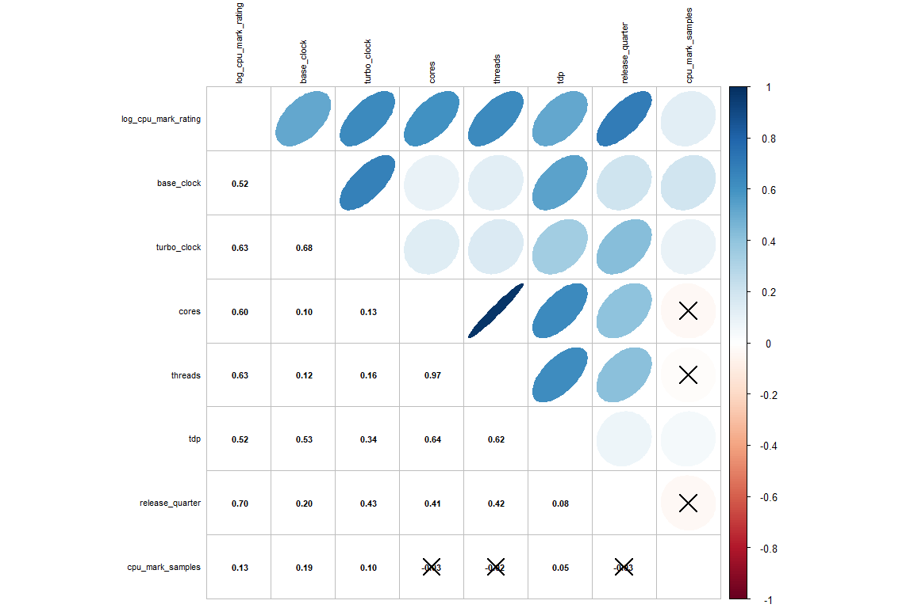<!-- -->

``` r
source("http://www.reuningscherer.net/s&ds230/Rfuncs/regJDRS.txt")
```

    ## 
    ## Attaching package: 'olsrr'

    ## The following object is masked from 'package:datasets':
    ## 
    ##     rivers

    ## Loading required package: carData

    ## 
    ## Attaching package: 'car'

    ## The following object is masked from 'package:dplyr':
    ## 
    ##     recode

``` r
pairsJDRS(passmark2)
```

    ## Warning in par(usr): argument 1 does not name a graphical parameter

    ## Warning in par(usr): argument 1 does not name a graphical parameter

    ## Warning in par(usr): argument 1 does not name a graphical parameter

    ## Warning in par(usr): argument 1 does not name a graphical parameter

    ## Warning in par(usr): argument 1 does not name a graphical parameter

    ## Warning in par(usr): argument 1 does not name a graphical parameter

    ## Warning in par(usr): argument 1 does not name a graphical parameter

    ## Warning in par(usr): argument 1 does not name a graphical parameter

    ## Warning in par(usr): argument 1 does not name a graphical parameter

    ## Warning in par(usr): argument 1 does not name a graphical parameter

    ## Warning in par(usr): argument 1 does not name a graphical parameter

    ## Warning in par(usr): argument 1 does not name a graphical parameter

    ## Warning in par(usr): argument 1 does not name a graphical parameter

    ## Warning in par(usr): argument 1 does not name a graphical parameter

    ## Warning in par(usr): argument 1 does not name a graphical parameter

    ## Warning in par(usr): argument 1 does not name a graphical parameter

    ## Warning in par(usr): argument 1 does not name a graphical parameter

    ## Warning in par(usr): argument 1 does not name a graphical parameter

    ## Warning in par(usr): argument 1 does not name a graphical parameter

    ## Warning in par(usr): argument 1 does not name a graphical parameter

    ## Warning in par(usr): argument 1 does not name a graphical parameter

    ## Warning in par(usr): argument 1 does not name a graphical parameter

    ## Warning in par(usr): argument 1 does not name a graphical parameter

    ## Warning in par(usr): argument 1 does not name a graphical parameter

    ## Warning in par(usr): argument 1 does not name a graphical parameter

    ## Warning in par(usr): argument 1 does not name a graphical parameter

    ## Warning in par(usr): argument 1 does not name a graphical parameter

    ## Warning in par(usr): argument 1 does not name a graphical parameter

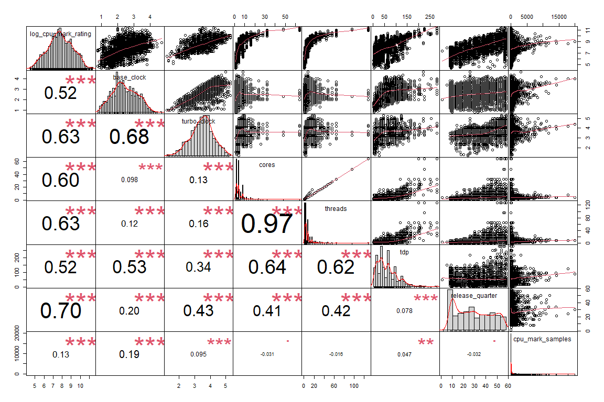<!-- -->

There appears to be a high multicollinearity between `cores` and
`threads` as well as `base_clock` and `turbo_clock`. Let’s omit `cores`
and `base_clock`.

``` r
passmark3 <- passmark2[, c("log_cpu_mark_rating", "turbo_clock", "threads", 
                           "tdp", "release_quarter", "cpu_mark_samples")]

# Repeat
sigcorr <- cor.mtest(passmark3, conf.level = .95)
corrplot.mixed(cor(passmark3, use="pairwise.complete.obs", method="pearson"), 
               lower.col="black", upper = "ellipse", 
               tl.col = "black", number.cex=.7, tl.pos = "lt", tl.cex=.7, 
               p.mat = sigcorr$p, sig.level = .05)
```

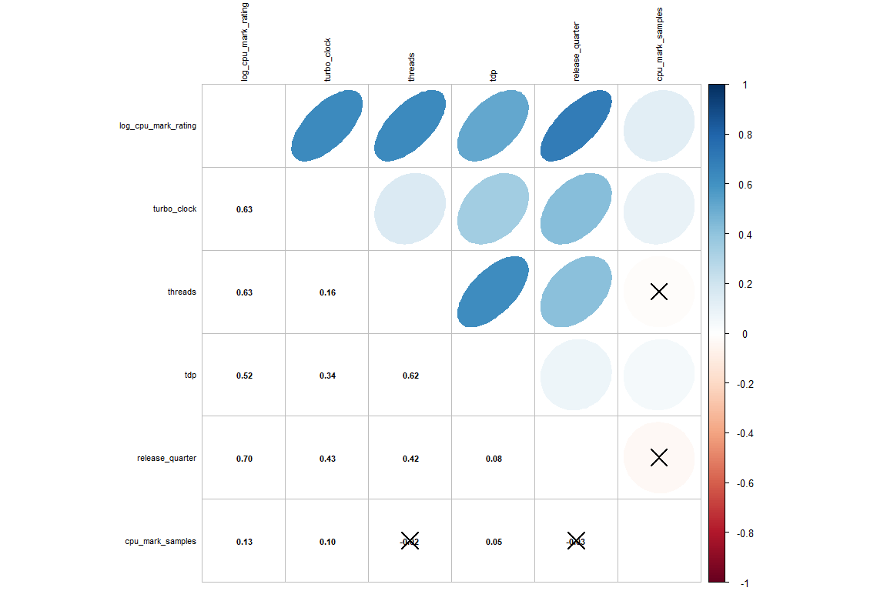<!-- -->

``` r
pairsJDRS(passmark3)
```

    ## Warning in par(usr): argument 1 does not name a graphical parameter

    ## Warning in par(usr): argument 1 does not name a graphical parameter

    ## Warning in par(usr): argument 1 does not name a graphical parameter

    ## Warning in par(usr): argument 1 does not name a graphical parameter

    ## Warning in par(usr): argument 1 does not name a graphical parameter

    ## Warning in par(usr): argument 1 does not name a graphical parameter

    ## Warning in par(usr): argument 1 does not name a graphical parameter

    ## Warning in par(usr): argument 1 does not name a graphical parameter

    ## Warning in par(usr): argument 1 does not name a graphical parameter

    ## Warning in par(usr): argument 1 does not name a graphical parameter

    ## Warning in par(usr): argument 1 does not name a graphical parameter

    ## Warning in par(usr): argument 1 does not name a graphical parameter

    ## Warning in par(usr): argument 1 does not name a graphical parameter

    ## Warning in par(usr): argument 1 does not name a graphical parameter

    ## Warning in par(usr): argument 1 does not name a graphical parameter

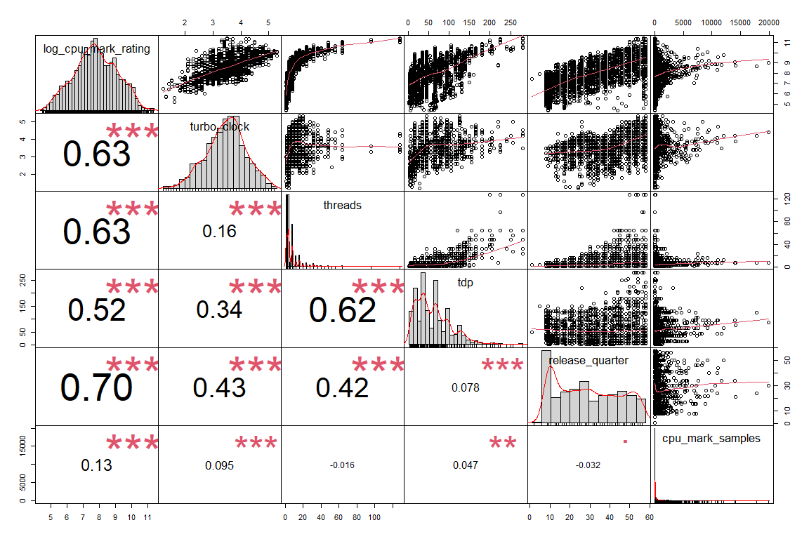<!-- -->

Let’s proceed with multiple regression.

``` r
lm1 <- lm(log_cpu_mark_rating ~ turbo_clock + threads + tdp + release_quarter +
            cpu_mark_samples, data = passmark3)
summary(lm1)
```

    ## 
    ## Call:
    ## lm(formula = log_cpu_mark_rating ~ turbo_clock + threads + tdp + 
    ##     release_quarter + cpu_mark_samples, data = passmark3)
    ## 
    ## Residuals:
    ##      Min       1Q   Median       3Q      Max 
    ## -2.18660 -0.22473  0.05921  0.31013  1.13486 
    ## 
    ## Coefficients:
    ##                   Estimate Std. Error t value Pr(>|t|)    
    ## (Intercept)      5.448e+00  5.510e-02  98.865  < 2e-16 ***
    ## turbo_clock      4.876e-01  1.941e-02  25.119  < 2e-16 ***
    ## threads          2.624e-02  1.289e-03  20.368  < 2e-16 ***
    ## tdp              5.133e-03  3.448e-04  14.885  < 2e-16 ***
    ## release_quarter  2.166e-02  1.079e-03  20.069  < 2e-16 ***
    ## cpu_mark_samples 2.513e-05  7.012e-06   3.585 0.000347 ***
    ## ---
    ## Signif. codes:  0 '***' 0.001 '**' 0.01 '*' 0.05 '.' 0.1 ' ' 1
    ## 
    ## Residual standard error: 0.4472 on 1666 degrees of freedom
    ##   (1808 observations deleted due to missingness)
    ## Multiple R-squared:  0.7968, Adjusted R-squared:  0.7962 
    ## F-statistic:  1307 on 5 and 1666 DF,  p-value: < 2.2e-16

Let’s repeat this for UserBenchmark scores.

``` r
userbenchmark <- combined_filtered[, c("userbenchmark_score", "turbo_clock",
                                       "threads", "tdp", "release_quarter", 
                                       "userbenchmark_samples")]


sigcorr <- cor.mtest(userbenchmark, conf.level = .95)
corrplot.mixed(cor(userbenchmark, use="pairwise.complete.obs", method="pearson"), 
               lower.col="black", upper = "ellipse", 
               tl.col = "black", number.cex=.7, tl.pos = "lt", tl.cex=.7, 
               p.mat = sigcorr$p, sig.level = .05)
```

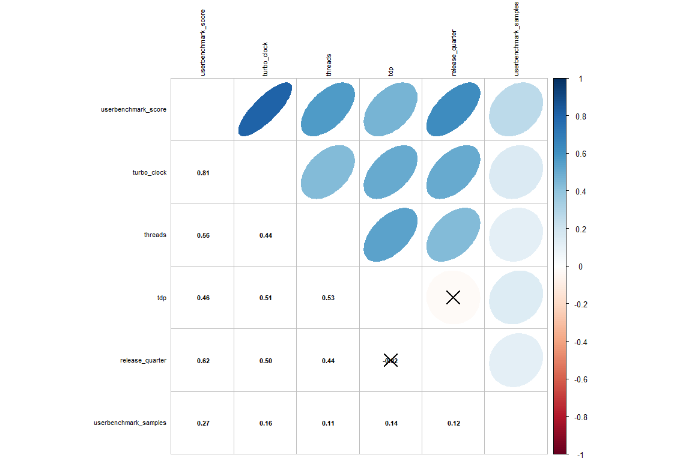<!-- -->

``` r
pairsJDRS(userbenchmark)
```

    ## Warning in par(usr): argument 1 does not name a graphical parameter

    ## Warning in par(usr): argument 1 does not name a graphical parameter

    ## Warning in par(usr): argument 1 does not name a graphical parameter

    ## Warning in par(usr): argument 1 does not name a graphical parameter

    ## Warning in par(usr): argument 1 does not name a graphical parameter

    ## Warning in par(usr): argument 1 does not name a graphical parameter

    ## Warning in par(usr): argument 1 does not name a graphical parameter

    ## Warning in par(usr): argument 1 does not name a graphical parameter

    ## Warning in par(usr): argument 1 does not name a graphical parameter

    ## Warning in par(usr): argument 1 does not name a graphical parameter

    ## Warning in par(usr): argument 1 does not name a graphical parameter

    ## Warning in par(usr): argument 1 does not name a graphical parameter

    ## Warning in par(usr): argument 1 does not name a graphical parameter

    ## Warning in par(usr): argument 1 does not name a graphical parameter

    ## Warning in par(usr): argument 1 does not name a graphical parameter

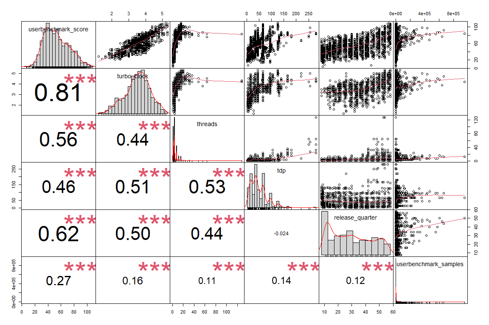<!-- -->

``` r
lm2 <- lm(userbenchmark_score ~ turbo_clock + threads + tdp + release_quarter +
            userbenchmark_samples, data = userbenchmark)
summary(lm2)
```

    ## 
    ## Call:
    ## lm(formula = userbenchmark_score ~ turbo_clock + threads + tdp + 
    ##     release_quarter + userbenchmark_samples, data = userbenchmark)
    ## 
    ## Residuals:
    ##     Min      1Q  Median      3Q     Max 
    ## -34.915  -7.314   1.723   8.396  21.702 
    ## 
    ## Coefficients:
    ##                         Estimate Std. Error t value Pr(>|t|)    
    ## (Intercept)           -4.866e+00  1.659e+00  -2.933  0.00343 ** 
    ## turbo_clock            1.615e+01  6.234e-01  25.906  < 2e-16 ***
    ## threads                2.734e-01  5.394e-02   5.068 4.73e-07 ***
    ## tdp                    4.583e-02  1.154e-02   3.972 7.62e-05 ***
    ## release_quarter        9.034e-02  3.375e-02   2.677  0.00754 ** 
    ## userbenchmark_samples  2.481e-05  4.409e-06   5.627 2.35e-08 ***
    ## ---
    ## Signif. codes:  0 '***' 0.001 '**' 0.01 '*' 0.05 '.' 0.1 ' ' 1
    ## 
    ## Residual standard error: 10.47 on 1061 degrees of freedom
    ##   (1166 observations deleted due to missingness)
    ## Multiple R-squared:  0.6889, Adjusted R-squared:  0.6874 
    ## F-statistic: 469.9 on 5 and 1061 DF,  p-value: < 2.2e-16

### Hypothesis Testing

#### Performance Between Processor Classes

We would like to compare the overall and single-threaded PassMark scores
across the different CPU classes - Desktop, Laptop, Mobile, and Server -
and see if any of the groups are significantly different from each other
in terms of performance.

We first look at the distributions of overall PassMark scores by class.

``` r
boxplot(passmark$cpu_mark_rating ~ passmark$class)
```

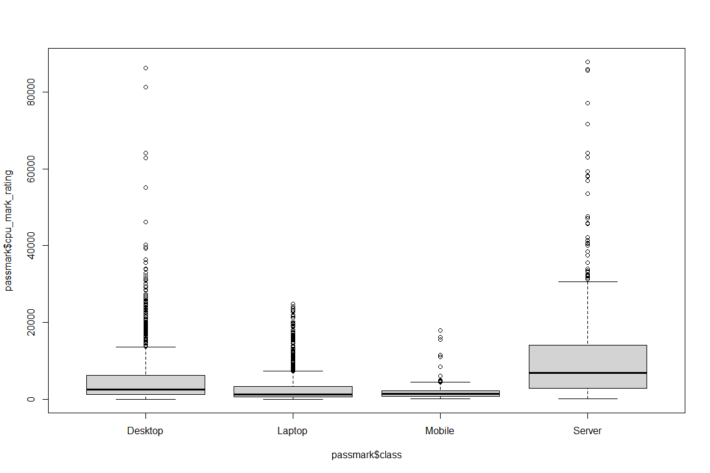<!-- -->

It’s pretty clear that `cpu_mark_rating` is non-normally distributed
across `class`, so I’m going to try a Box-Cox transformation.

``` r
library(car)
boxCox(lm(cpu_mark_rating ~ class, data = passmark))
```

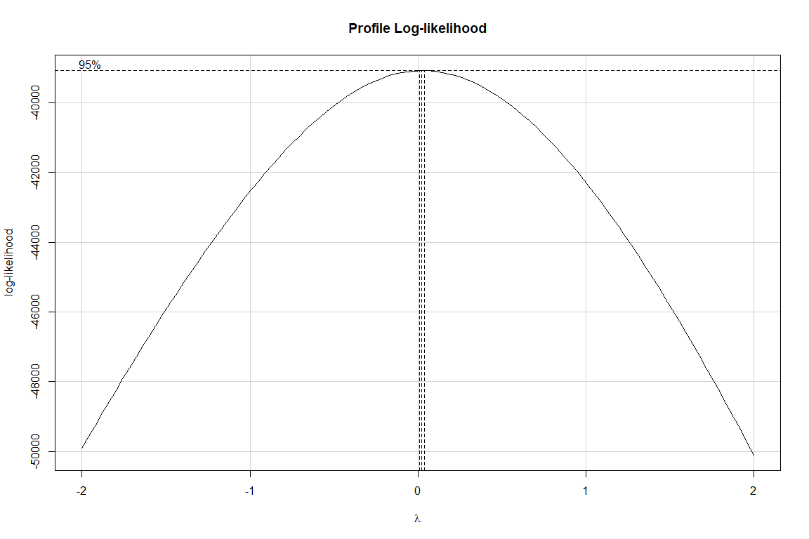<!-- -->

Box-Cox suggests a lambda of about 0, which means a log transformation
would be best.

``` r
boxplot(log(passmark$cpu_mark_rating) ~ passmark$class)
```

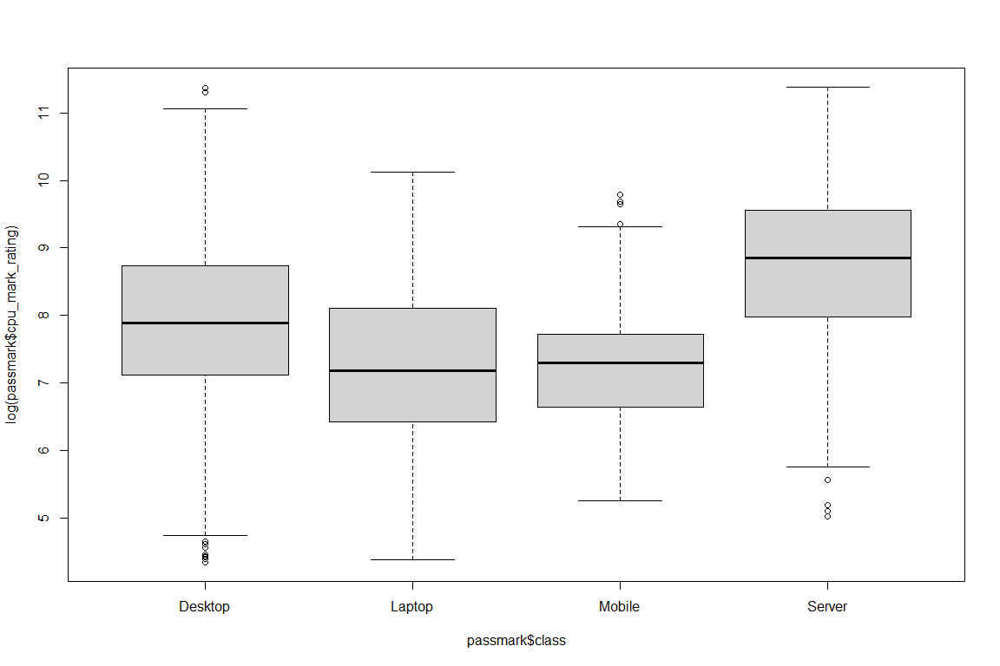<!-- -->

Variances do not seem to be equal, but let’s check the ratio of largest
sample standard deviation to smallest.

``` r
sds <- tapply(passmark$log_cpu_mark_rating, passmark$class, sd)
max(sds)/min(sds)
```

    ## [1] 1.502887

This is a pretty reasonable ratio, so we can proceed with one way ANOVA.

``` r
aov1 <- aov(passmark$log_cpu_mark_rating ~ passmark$class)
summary(aov1)
```

    ##                  Df Sum Sq Mean Sq F value Pr(>F)    
    ## passmark$class    3   1080   360.0   251.8 <2e-16 ***
    ## Residuals      3248   4644     1.4                   
    ## ---
    ## Signif. codes:  0 '***' 0.001 '**' 0.01 '*' 0.05 '.' 0.1 ' ' 1
    ## 228 observations deleted due to missingness

The results of the ANOVA test suggest that the groups are indeed
different, so a Tukey test should be performed to find which groups are
different from which.

``` r
TukeyHSD(aov1)
```

    ##   Tukey multiple comparisons of means
    ##     95% family-wise confidence level
    ## 
    ## Fit: aov(formula = passmark$log_cpu_mark_rating ~ passmark$class)
    ## 
    ## $`passmark$class`
    ##                       diff        lwr        upr     p adj
    ## Laptop-Desktop -0.62708025 -0.7571831 -0.4969774 0.0000000
    ## Mobile-Desktop -0.68653173 -0.8878561 -0.4852073 0.0000000
    ## Server-Desktop  0.84918814  0.7019332  0.9964431 0.0000000
    ## Mobile-Laptop  -0.05945148 -0.2600025  0.1410996 0.8715356
    ## Server-Laptop   1.47626839  1.3300726  1.6224642 0.0000000
    ## Server-Mobile   1.53571987  1.3236397  1.7478000 0.0000000

``` r
par(mar=c(5, 8, 4, 1))
plot(TukeyHSD(aov1), las = 1)
```

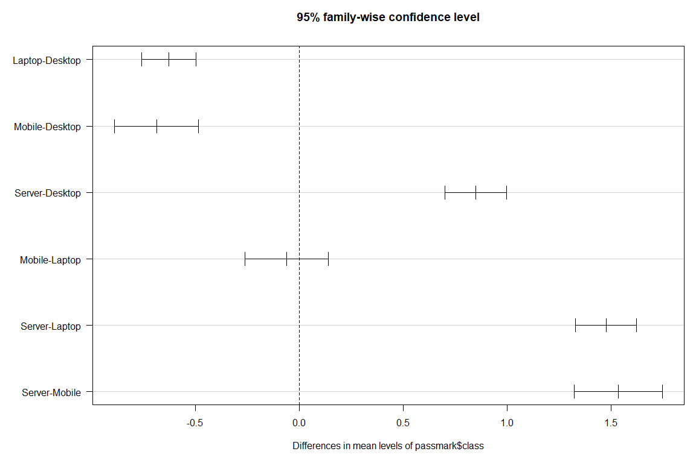<!-- -->

It’s clear that every CPU class differs from each other except Mobile
with Laptop with respect to log-transformed overall PassMark scores,
with Server CPUs having significantly greater mean log scores when
compared to Laptop, Desktop, and Mobile CPUs.

We should finally check our residual plots.

``` r
source("http://www.reuningscherer.net/s&ds230/Rfuncs/regJDRS.txt")
myResPlots(aov1, label = "Log Overall PassMark Score")
```

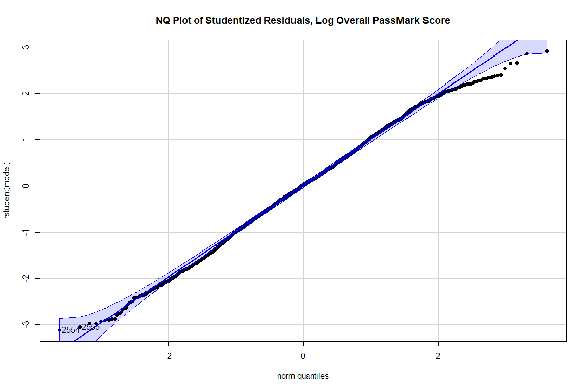<!-- -->

    ## Warning: 'ols_cooksd_chart' is deprecated.
    ## Use 'ols_plot_cooksd_chart()' instead.
    ## See help("Deprecated")

    ## Warning: 'ols_rsdlev_plot' is deprecated.
    ## Use 'ols_plot_resid_lev()' instead.
    ## See help("Deprecated")

<!-- -->

There does not appear to be any heteroskedasticity or glaringly large
residuals.

Let’s repeat the process for single-threaded scores.

``` r
boxplot(passmark$cpu_mark_single_thread_rating ~ passmark$class)
```

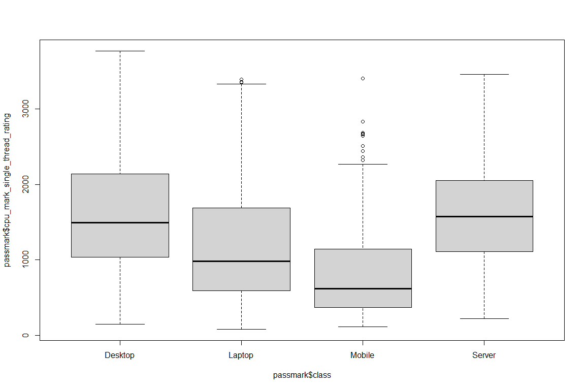<!-- -->

``` r
# No need to transform, check standard deviations
sds <- tapply(passmark$cpu_mark_single_thread_rating, passmark$class, sd)
max(sds)/min(sds)
```

    ## [1] 1.254962

``` r
# Looks good, one way ANOVA
aov2 <- aov(passmark$cpu_mark_single_thread_rating ~ passmark$class)
summary(aov2)
```

    ##                  Df    Sum Sq  Mean Sq F value Pr(>F)    
    ## passmark$class    3 2.108e+08 70265117   137.6 <2e-16 ***
    ## Residuals      3248 1.659e+09   510642                   
    ## ---
    ## Signif. codes:  0 '***' 0.001 '**' 0.01 '*' 0.05 '.' 0.1 ' ' 1
    ## 228 observations deleted due to missingness

The results of the ANOVA test suggest that the groups are indeed
different, so a Tukey test should be performed to find which groups are
different from which.

``` r
TukeyHSD(aov2)
```

    ##   Tukey multiple comparisons of means
    ##     95% family-wise confidence level
    ## 
    ## Fit: aov(formula = passmark$cpu_mark_single_thread_rating ~ passmark$class)
    ## 
    ## $`passmark$class`
    ##                       diff        lwr        upr     p adj
    ## Laptop-Desktop -405.402409 -483.15439 -327.65043 0.0000000
    ## Mobile-Desktop -748.097529 -868.41290 -627.78216 0.0000000
    ## Server-Desktop    4.763186  -83.23922   92.76559 0.9990396
    ## Mobile-Laptop  -342.695120 -462.54832 -222.84192 0.0000000
    ## Server-Laptop   410.165596  322.79612  497.53507 0.0000000
    ## Server-Mobile   752.860715  626.11750  879.60393 0.0000000

``` r
par(mar=c(5, 8, 4, 1))
plot(TukeyHSD(aov2), las = 1)
```

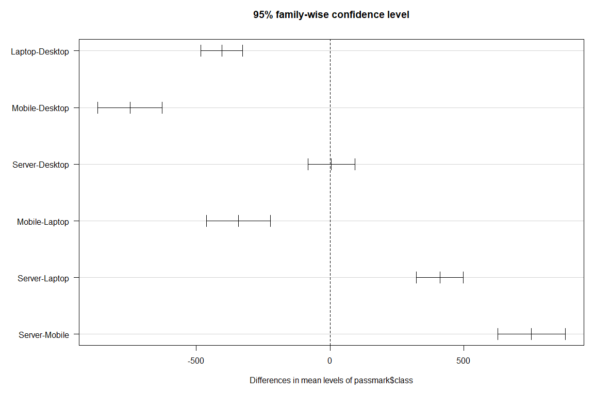<!-- -->

Interestingly, for mean single-threaded PassMark scores, all CPU classes
differ from each other, including Mobile with Laptop, except Server with
Desktop. The lack of difference for single-threaded performance as
opposed to multi-threaded performance does make sense though as server
CPUs are designed for scalability and parallelized processes. However,
this difference in results for mobile and laptop CPUs between multi- and
single-threaded performances is a new question worthy of some research.

#### Intel vs. AMD

Intel vs. AMD has long been a debate in the tech community. Although
Intel had long dominated the CPU market, AMD has increasingly
demonstrated in recent years to be a strong competitor and arguably its
performance edge over Intel. Consequently, we would like to see if
benchmark scores reflect this competitiveness from two angles: overall
mean scores and mean scores within the top CPUs of each brand.

We will be using the `combined_filtered` dataframe, which has PassMark
and UserBenchmark data for just laptop and desktop processors, as these
are almost always the only processor classes that matter to the typical
consumer. This dataframe will be filtered for AMD and Intel CPUs only.

First let’s look at overall mean scores, starting with PassMark.

``` r
intel_amd <- combined_filtered[combined_filtered$brand == "Intel" | 
                                 combined_filtered$brand == "AMD", ]
intel_amd$log_cpu_mark_rating <- log(intel_amd$cpu_mark_rating)

boxplot(intel_amd$log_cpu_mark_rating ~ intel_amd$brand)
```

<!-- -->

Just from the boxplot, there doesn’t seem to be any significant
difference, and a t-test confirms this.

``` r
t.test(log_cpu_mark_rating ~ brand, data = intel_amd)
```

    ## 
    ##  Welch Two Sample t-test
    ## 
    ## data:  log_cpu_mark_rating by brand
    ## t = 0.46244, df = 1656.8, p-value = 0.6438
    ## alternative hypothesis: true difference in means between group AMD and group Intel is not equal to 0
    ## 95 percent confidence interval:
    ##  -0.08394198  0.13573508
    ## sample estimates:
    ##   mean in group AMD mean in group Intel 
    ##            7.648658            7.622762

However, this considers all CPUs for each brand, which isn’t really
helpful in determining what the better brand is since both brands
release low-end CPUs every year for products that don’t require any
heavy lifting that target a more general-everyday-use audience. As a
result, it may be more interesting to consider only the top 30 best
performing CPUs for each brand.

``` r
# Get top 30 for each brand
top30_intel <- slice_max(intel_amd[intel_amd$brand == "Intel", ], 
                         order_by = cpu_mark_rating, n = 30)
top30_amd <- slice_max(intel_amd[intel_amd$brand == "AMD", ], 
                       order_by = cpu_mark_rating, n = 30)

top30s <- rbind(top30_intel, top30_amd)
```

``` r
boxplot(top30s$log_cpu_mark_rating ~ top30s$brand)
```

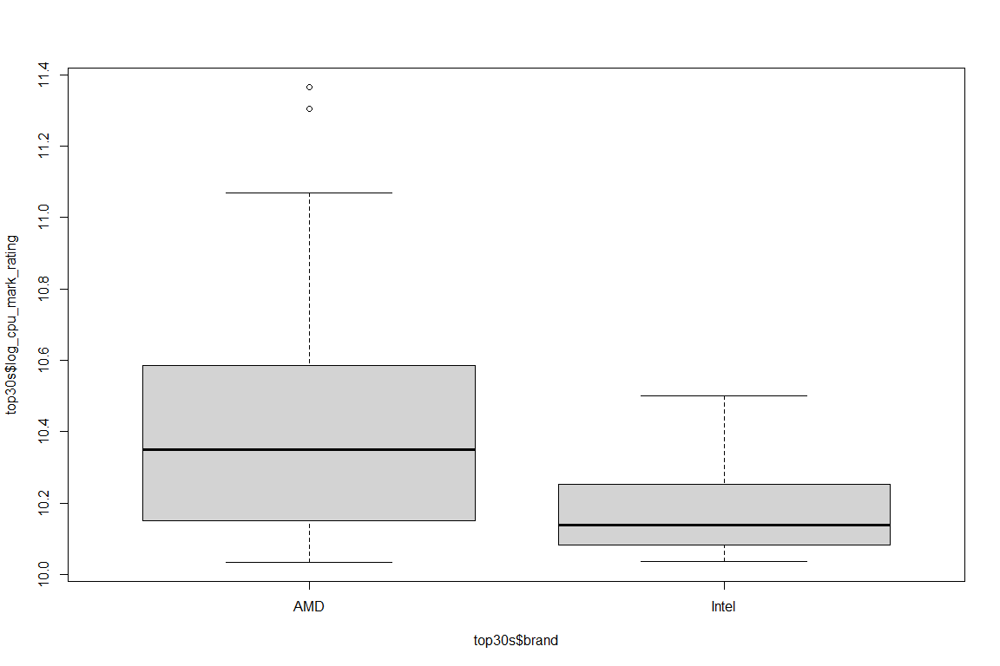<!-- -->

As mentioned earlier, we hypothesize that AMD has a performance edge
over Intel, so our null hypothesis is that the mean log PassMark score
for AMD CPUs is equal to that for Intel and the alternative is that the
mean score for AMD is greater than that for Intel.

``` r
t.test(log_cpu_mark_rating ~ brand, data = top30s, alternative = "greater")
```

    ## 
    ##  Welch Two Sample t-test
    ## 
    ## data:  log_cpu_mark_rating by brand
    ## t = 3.6162, df = 35.222, p-value = 0.0004634
    ## alternative hypothesis: true difference in means between group AMD and group Intel is greater than 0
    ## 95 percent confidence interval:
    ##  0.1389224       Inf
    ## sample estimates:
    ##   mean in group AMD mean in group Intel 
    ##            10.43651            10.17580

It’s clear from the very small p-value that the mean log PassMark
overall score for the top 30 AMD CPUs is indeed greater than that for
the top 30 Intel CPUs in a statistically significant way.

Now let’s see if these results are reflected in UserBenchmark data.

``` r
boxplot(intel_amd$userbenchmark_score ~ intel_amd$brand)
```

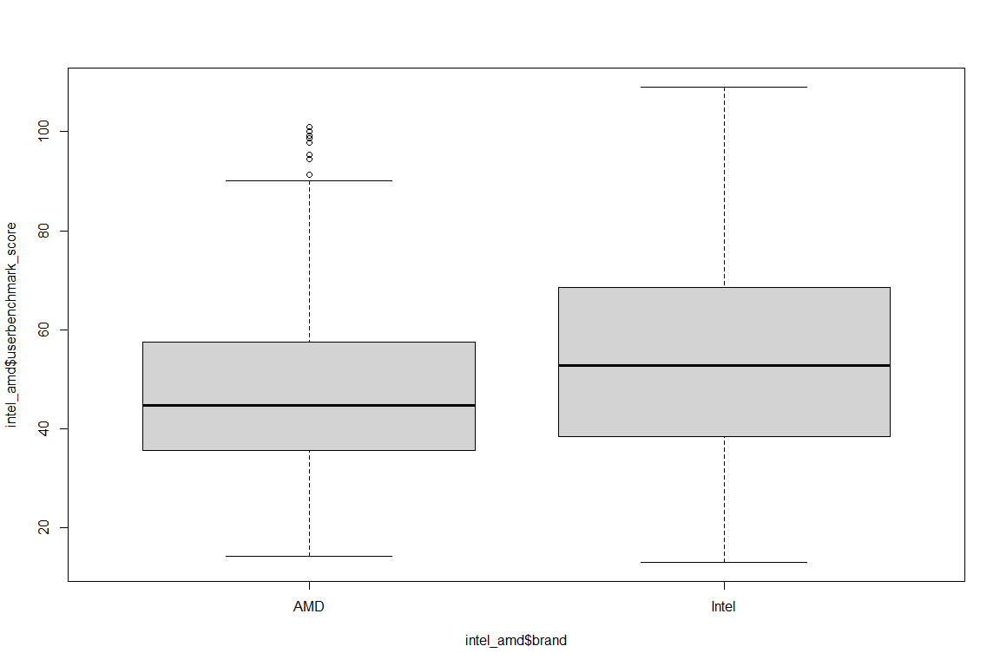<!-- -->

``` r
t.test(userbenchmark_score ~ brand, data = intel_amd)
```

    ## 
    ##  Welch Two Sample t-test
    ## 
    ## data:  userbenchmark_score by brand
    ## t = -7.3312, df = 1701.9, p-value = 3.509e-13
    ## alternative hypothesis: true difference in means between group AMD and group Intel is not equal to 0
    ## 95 percent confidence interval:
    ##  -7.848143 -4.535179
    ## sample estimates:
    ##   mean in group AMD mean in group Intel 
    ##            48.23414            54.42580

Interestingly for UserBenchmark, we find that the mean scores for all
Intel and AMD CPUs are statistically significant, specifically in favor
of Intel.

We next check the top 30 CPUs of each brand.

``` r
top30_intel <- slice_max(intel_amd[intel_amd$brand == "Intel", ], 
                         order_by = userbenchmark_score, n = 30)
top30_amd <- slice_max(intel_amd[intel_amd$brand == "AMD", ], 
                       order_by = userbenchmark_score, n = 30)
top30s <- rbind(top30_intel, top30_amd)

boxplot(top30s$userbenchmark_score ~ top30s$brand)
```

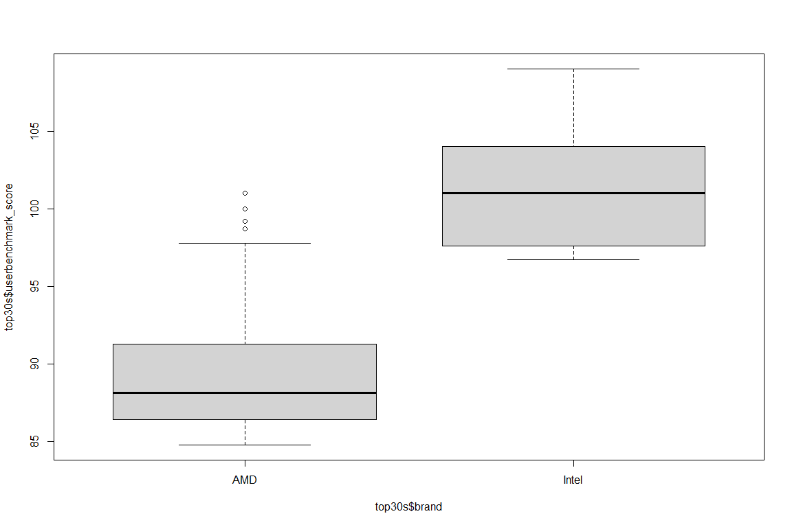<!-- -->

``` r
t.test(userbenchmark_score ~ brand, data = top30s, alternative = "less")
```

    ## 
    ##  Welch Two Sample t-test
    ## 
    ## data:  userbenchmark_score by brand
    ## t = -9.9549, df = 52.924, p-value = 5.004e-14
    ## alternative hypothesis: true difference in means between group AMD and group Intel is less than 0
    ## 95 percent confidence interval:
    ##       -Inf -9.330312
    ## sample estimates:
    ##   mean in group AMD mean in group Intel 
    ##             89.8700            101.0867

Again, the mean UserBenchmark score for the top 30 Intel CPUs is greater
than that for the top 30 AMD CPUs, which is the complete opposite
conclusion made for (log) PassMark scores.

What is the source of this discrepancy?

#### Is UserBenchmark Biased?

Speculation surrounding UserBenchmark being biased in favor of Intel
CPUs has been well-documented across the Internet, from YouTube videos
to tech forums. A rather promising argument for why this bias is present
that I found on Reddit was that efps results, as seen in
`userbenchmark_efps`, have a large impact on the overall score and
heavily weigh 0.1% lows in frame rates. Intel definitely has an
advantage here as seen below:

``` r
boxplot(intel_amd$userbenchmark_efps ~ intel_amd$brand)
```

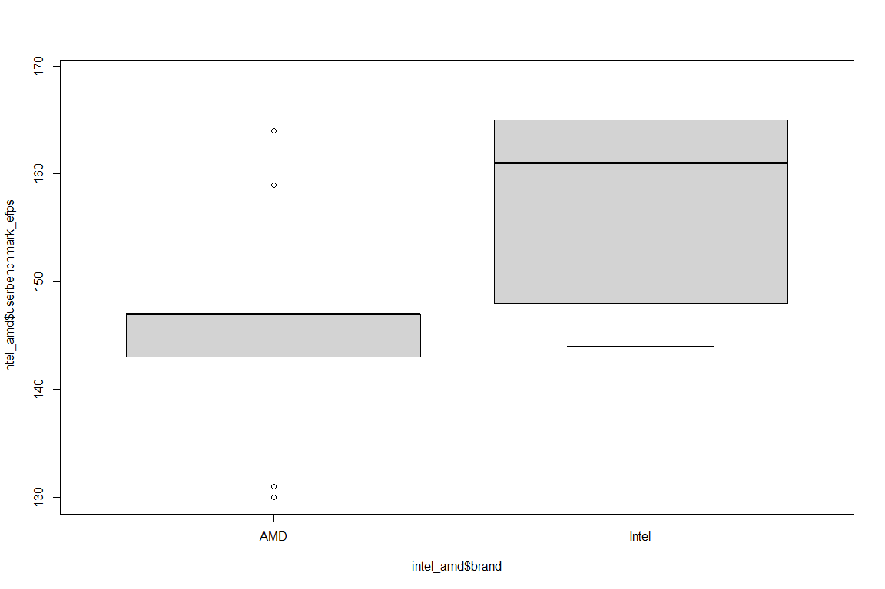<!-- -->

However, when it comes to a practical experience, 0.1% lows, while
important in the smoothness of playing games, aren’t relevant to the
point of completely swaying the overall score. Moreover, there are
plenty of other reasons for the “Intel bias” and fishy occurrences
well-documented on the Internet, such as [this
article](https://ownsnap.com/userbenchmark-biased/).

We have come up with our own statistical method for determining if
UserBenchmark is biased in favor of Intel. It does however rely on one
important assumption that PassMark is an unbiased source. PassMark has
its flaws, but there really isn’t any one perfect benchmark platform;
more importantly, PassMark has for the most part consistently reflected
the analyses and comparisons made by leading tech reviewers in the
community as well as numbers published by AMD and Intel themselves.

The idea is that there should be a linear relationship mapping PassMark
scores to UserBenchmark scores. The rationale for this is is that a CPU
that performs very poorly or very well on PassMark should perform
roughly equally as poorly or well on UserBenchmark and everything in
between. With PassMark acting as an unbiased reference, the regression
line for each of Intel and AMD would pretty much be identical if
UserBenchmark was unbiased. However, if there is a statistically
significant difference in the slopes (in other words they are not
parallel), that would indicate that UserBenchmark is not fairly
reflecting relative performance.

``` r
plot(intel_amd$userbenchmark_score ~ intel_amd$log_cpu_mark_rating, 
     col = factor(intel_amd$brand), pch = 20, cex = 1.2)
legend("topleft", col = 1:2, legend = levels(factor(intel_amd$brand)), pch = 20)
```

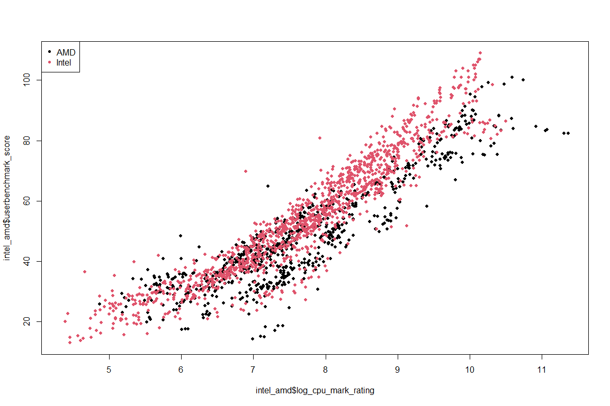<!-- --> There
does appear to be some curvature in the scatterplot, we can try
transforming `userbenchmark_score`.

``` r
trans <- boxCox(lm(userbenchmark_score ~ brand, data = intel_amd))
```

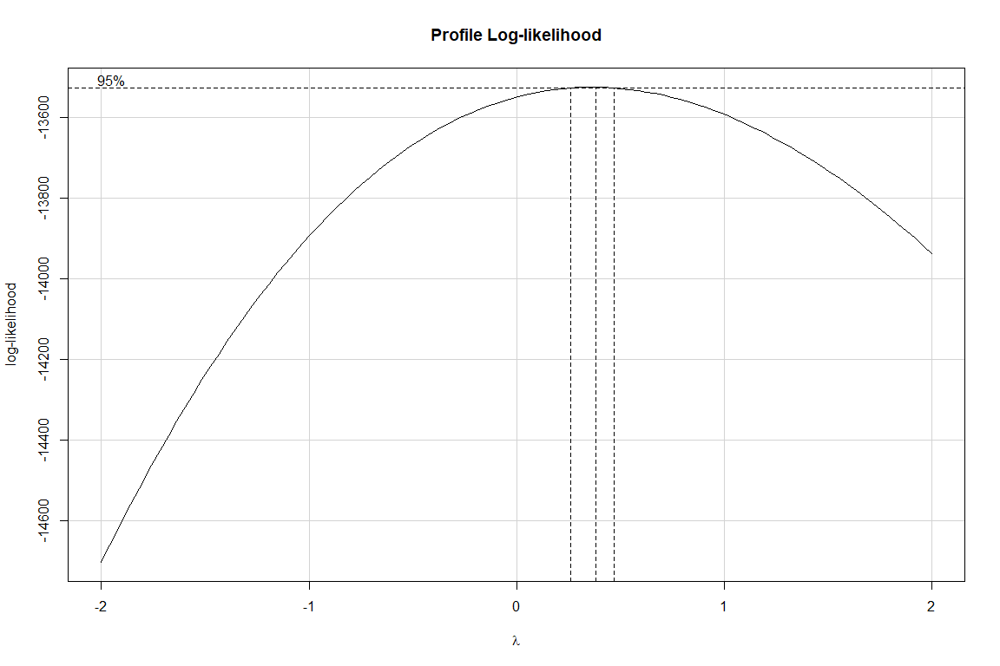<!-- -->

``` r
trans$x[which.max(trans$y)]
```

    ## [1] 0.3838384

The value of lambda is roughly 0.38, which means a reasonable
transformation is a cube root.

``` r
# Apply transformation and re plot
intel_amd$trans_userbenchmark_score <- (intel_amd$userbenchmark_score) ^ (1/3)

plot(intel_amd$trans_userbenchmark_score ~ intel_amd$log_cpu_mark_rating, 
     col = factor(intel_amd$brand), pch = 20, cex = 1.2)
legend("topleft", col = 1:2, legend = levels(factor(intel_amd$brand)), pch = 20)
```

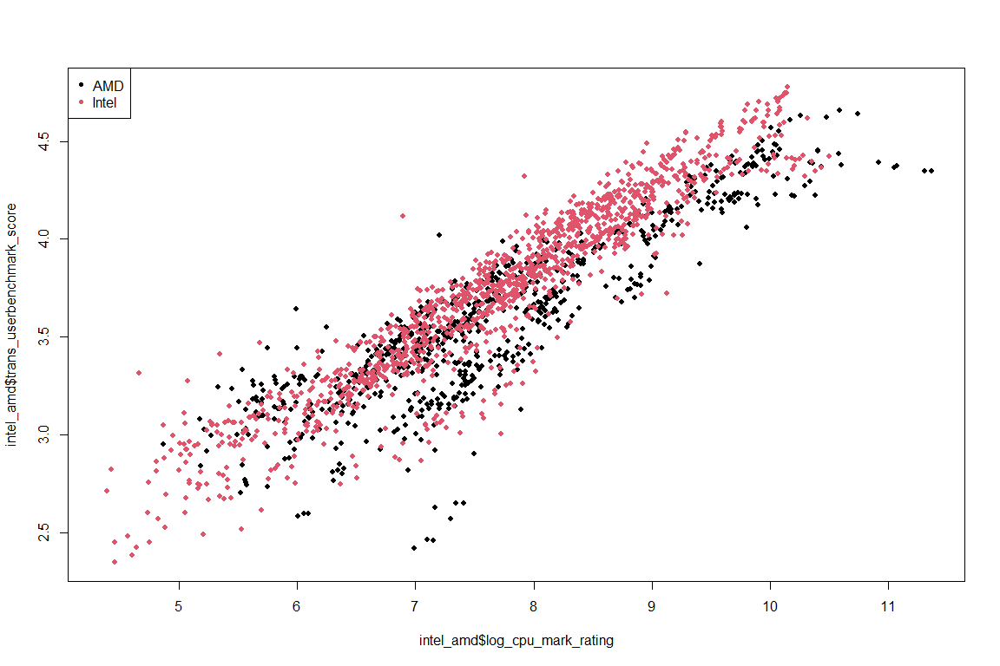<!-- -->

We now perform an ANCOVA with `brand` as the categorical variable for
which we will be examining its interaction with `log_cpu_mark_rating`.

``` r
m1 <- lm(trans_userbenchmark_score ~ log_cpu_mark_rating*brand, 
         data = intel_amd)
Anova(m1, type = 3)
```

|                           |      Sum Sq |   Df |    F value | Pr(\>F) |
|:--------------------------|------------:|-----:|-----------:|--------:|
| (Intercept)               |  27.4559773 |    1 |  925.81776 |       0 |
| log_cpu_mark_rating       | 107.0706124 |    1 | 3610.42966 |       0 |
| brand                     |   0.9908176 |    1 |   33.41045 |       0 |
| log_cpu_mark_rating:brand |   2.0725561 |    1 |   69.88676 |       0 |
| Residuals                 |  59.6677106 | 2012 |         NA |      NA |

``` r
summary(m1)
```

    ## 
    ## Call:
    ## lm(formula = trans_userbenchmark_score ~ log_cpu_mark_rating * 
    ##     brand, data = intel_amd)
    ## 
    ## Residuals:
    ##      Min       1Q   Median       3Q      Max 
    ## -0.97471 -0.07574  0.02266  0.11490  0.68935 
    ## 
    ## Coefficients:
    ##                                 Estimate Std. Error t value Pr(>|t|)    
    ## (Intercept)                     1.216834   0.039992   30.43  < 2e-16 ***
    ## log_cpu_mark_rating             0.310126   0.005161   60.09  < 2e-16 ***
    ## brandIntel                     -0.291390   0.050412   -5.78 8.63e-09 ***
    ## log_cpu_mark_rating:brandIntel  0.054266   0.006491    8.36  < 2e-16 ***
    ## ---
    ## Signif. codes:  0 '***' 0.001 '**' 0.01 '*' 0.05 '.' 0.1 ' ' 1
    ## 
    ## Residual standard error: 0.1722 on 2012 degrees of freedom
    ##   (150 observations deleted due to missingness)
    ## Multiple R-squared:  0.8613, Adjusted R-squared:  0.8611 
    ## F-statistic:  4165 on 3 and 2012 DF,  p-value: < 2.2e-16

As one can see from the summary information, the coefficient
`log_cpu_mark_rating:brandIntel` is statistically significant and
positive which indicates that Intel CPUs with a given PassMark score
tend to have higher corresponding UserBenchmark scores than AMD CPUs
with the same PassMark score. In other words, the slope of the
regression line for AMD is `log_cpu_mark_rating` while for Intel it is
(`log_cpu_mark_rating` + `log_cpu_mark_rating:brandIntel`).

To visualize this difference in slopes, we overlay the scatterplot with
both regression lines.

``` r
# Get coefficients of model
coefs <- coef(m1)
round(coefs, 4)
```

    ##                    (Intercept)            log_cpu_mark_rating 
    ##                         1.2168                         0.3101 
    ##                     brandIntel log_cpu_mark_rating:brandIntel 
    ##                        -0.2914                         0.0543

``` r
# Plot with regression lines
plot(intel_amd$trans_userbenchmark_score ~ intel_amd$log_cpu_mark_rating, 
     col = factor(intel_amd$brand), pch = 20, cex = 1.2, 
     xlab = "PassMark Score (Log Transformed)", 
     ylab = "UserBenchmark Score (Cube Root Transformed)")
legend("topleft", col = 1:2, legend = levels(factor(intel_amd$brand)), pch = 20)

abline(a = coefs[1], b = coefs[2], col = 1, lwd = 3)
abline(a = coefs[1] + coefs[3], b = coefs[2] + coefs[4], col = 2, lwd = 3)
```

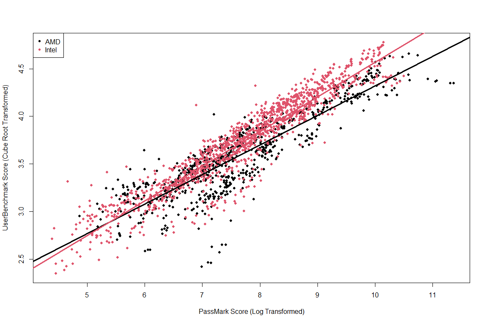<!-- -->

Therefore, we can conclude there is evidence that UserBenchmark is
biased in favor of Intel.

## Conclusion

UserBenchmark bad lol
