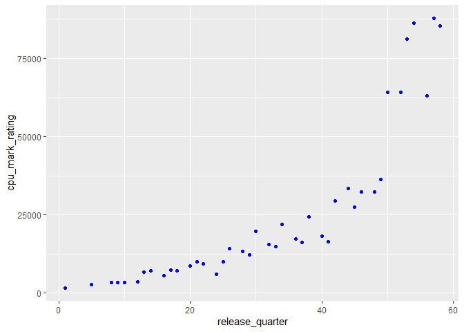
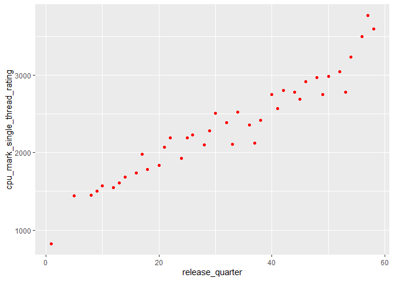
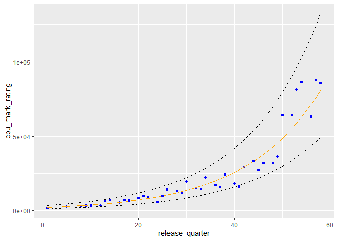
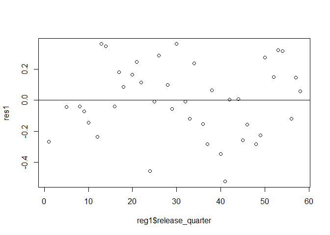
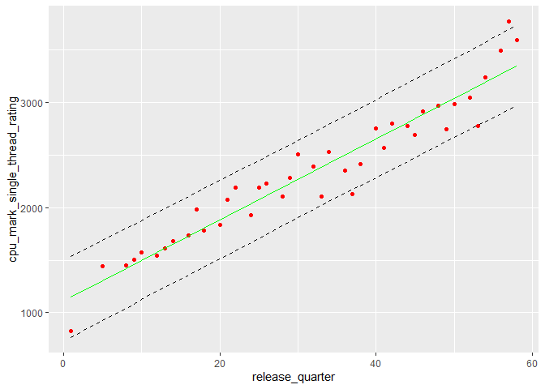
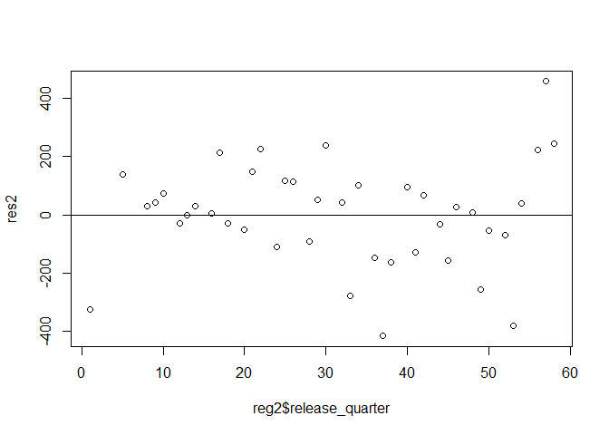

CPU Performance Analysis
================

## Set-Up

First, the necessary packages are loaded in.

``` r
pacman::p_load(pacman, rio, dplyr, ggplot2, jsonlite)
```

Next, we import our data into a dataframe.

``` r
df <- import("../data/cpu_cleaned.json")
head(df)
```

<div class="kable-table">

| name                    | base\_clock | cores | threads | cpu\_mark\_overall\_rank | cpu\_mark\_rating | cpu\_mark\_single\_thread\_rating | cpu\_mark\_cross\_platform\_rating | cpu\_mark\_samples | test\_suite\_integer\_math | test\_suite\_floating\_point\_math | test\_suite\_find\_prime\_numbers | test\_suite\_random\_string\_sorting | test\_suite\_data\_encryption | test\_suite\_data\_compression | test\_suite\_physics | test\_suite\_extended\_instructions | test\_suite\_single\_thread | class  | socket | turbo\_clock | tdp | release\_quarter | old\_cpu\_mark\_rating | old\_cpu\_mark\_single\_thread\_rating |
|:------------------------|------------:|------:|--------:|-------------------------:|------------------:|----------------------------------:|-----------------------------------:|-------------------:|---------------------------:|-----------------------------------:|----------------------------------:|-------------------------------------:|------------------------------:|-------------------------------:|---------------------:|------------------------------------:|----------------------------:|:-------|:-------|-------------:|----:|-----------------:|-----------------------:|---------------------------------------:|
| AArch64 rev 0 (aarch64) |         2.5 |     8 |       8 |                     1589 |              2499 |                              1048 |                               6694 |                 25 |                      25705 |                               6224 |                                10 |                                    8 |                         553.6 |                           53.0 |                  214 |                                1018 |                        1048 | NA     | NA     |           NA |  NA |               NA |                     NA |                                     NA |
| AArch64 rev 1 (aarch64) |      2362.0 |     8 |       8 |                     1666 |              2316 |                              1037 |                               6817 |                 45 |                      24516 |                               6025 |                                10 |                                    8 |                         493.3 |                           52.0 |                  233 |                                 832 |                        1037 | NA     | NA     |           NA |  NA |               NA |                     NA |                                     NA |
| AArch64 rev 2 (aarch64) |         2.2 |     8 |       8 |                     1862 |              1956 |                               925 |                               5495 |                 24 |                      22846 |                               5814 |                                 7 |                                    8 |                         430.0 |                           42.7 |                  184 |                                 766 |                         925 | NA     | NA     |           NA |  NA |               NA |                     NA |                                     NA |
| AArch64 rev 4 (aarch64) |      2112.0 |     8 |       8 |                     2042 |              1658 |                               642 |                               3943 |                 43 |                      24632 |                               3724 |                                 5 |                                    6 |                         473.1 |                           35.3 |                   92 |                                 548 |                         642 | NA     | NA     |           NA |  NA |               NA |                     NA |                                     NA |
| AC8257V/WAB             |      2001.0 |     8 |       8 |                     2805 |               693 |                               495 |                               1693 |                  1 |                       8844 |                               1282 |                                 2 |                                    3 |                         205.5 |                           13.2 |                   53 |                                 211 |                         495 | NA     | NA     |           NA |  NA |               NA |                     NA |                                     NA |
| AMD 3015Ce              |         1.2 |     2 |       4 |                     2164 |              1474 |                              1391 |                               4192 |                  1 |                      10231 |                               4968 |                                 8 |                                    3 |                         267.0 |                           32.0 |                  151 |                                 737 |                        1391 | Mobile | FT5    |          2.3 |   6 |               NA |                     NA |                                     NA |

</div>

## Data Preparation

It’s clear that there is a lot of data, much of it being extraneous.
Since I want to analyze CPU performance over time, I need to isolate the
relevant columns and remove any rows with NaN entries in those columns.

``` r
df <- df[, c("name", "cpu_mark_rating", "cpu_mark_single_thread_rating", "release_quarter")]
cpu_perf <- na.omit(df)

head(cpu_perf)
```

<div class="kable-table">

|     | name                    | cpu\_mark\_rating | cpu\_mark\_single\_thread\_rating | release\_quarter |
|:----|:------------------------|------------------:|----------------------------------:|-----------------:|
| 7   | AMD 3015e               |              2678 |                              1408 |               54 |
| 8   | AMD 3020e               |              2611 |                              1472 |               54 |
| 9   | AMD 4700S               |             18045 |                              2389 |               58 |
| 10  | AMD A10 Micro-6700T APU |              1291 |                               703 |               34 |
| 11  | AMD A10 PRO-7350B APU   |              1910 |                               911 |               30 |
| 12  | AMD A10 PRO-7800B APU   |              3194 |                              1497 |               32 |

</div>

The `cpu_mark_rating` and `cpu_mark_single_thread_rating` columns refer
to the overall and single thread scores, respectively, determined by the
PassMark benchmark software for each CPU. The `release_quarter` column
refers to an integer computed by taking the difference between the year
of release and 2007, multiplying by four, and adding the year’s quarter
as an indication of time.

I want to examine how overall and single thread performance has changed
over time. One way of displaying these improvements is plotting maximum
scores for the CPUs in each release quarter. Plotting mean or median
scores wouldn’t make much sense since most CPUs are created for average
consumers.

In order to do this, I need to create a new dataframe that takes
`cpu_perf`, groups by release quarter, and finds both maximum scores.

``` r
result <- aggregate(cbind(cpu_mark_rating, cpu_mark_single_thread_rating) ~ release_quarter, data = cpu_perf, max)

head(result)
```

<div class="kable-table">

| release\_quarter | cpu\_mark\_rating | cpu\_mark\_single\_thread\_rating |
|-----------------:|------------------:|----------------------------------:|
|                1 |              1678 |                               827 |
|                5 |              2705 |                              1446 |
|                8 |              3288 |                              1452 |
|                9 |              3386 |                              1503 |
|               10 |              3354 |                              1571 |
|               12 |              3471 |                              1546 |

</div>

## Plotting

Let’s first look at overall performance.

``` r
ggplot(result, aes(x = release_quarter, y = cpu_mark_rating)) + geom_point(color = "blue")
```

<!-- -->

There appears to be a strong, positive exponential relationship. This
makes sense as these overall scores reflect multi-threaded performance,
and CPUs are being designed with increasing numbers of cores and there
have been improvements in multi-threading technologies like Intel’s
Hyper-Threading and AMD’s Simultaneous Multi-Threading.

Next, let’s look at single thread performance.

``` r
ggplot(result, aes(x = release_quarter, y = cpu_mark_single_thread_rating)) + geom_point(color = "red")
```

<!-- -->

There does seem to be a moderately strong positive linear association
between time passed and single thread performance of the best CPUs of
each quarter. This makes sense as single thread performance is largely
dictated by the CPU’s frequency, number of transistors, power draw, and
thermal stability. Improvements in each of these have been fairly slow
yet steady, and the data appears to reflect these changes in increasing
single thread performance.

However, an issue with using a linear model specifically for predicting
single thread performance is that it is bottlenecked by physical and
technological capabilities. There can only be so many transistors that
fit on the face of a processor, and how high a clock speed can be pushed
is limited by the cooling required to compensate for higher power draw.
In other words, it is likely that the rate of increase in single thread
performance will slow down, but with the given data this cannot be
properly reflected.

## Regression Analysis

To create an exponential model for overall performance, I perform a
least-squares regression with the natural logarithm of `cpu_mark_rating`
and `release_quarter`.

``` r
p1_model <- lm(log(cpu_mark_rating) ~ release_quarter, data = result)
```

Next, I calculate the 95% prediction intervals for the model.

``` r
p1_pred_int <- predict(p1_model, interval = "prediction", level = 0.95)
```

    ## Warning in predict.lm(p1_model, interval = "prediction", level = 0.95): predictions on current data refer to _future_ responses

``` r
reg1 <- data.frame(cbind(result$release_quarter, result$cpu_mark_rating, exp(p1_pred_int)))
reg1 <- reg1 %>%
  rename(
    release_quarter = V1,
    cpu_mark_rating = V2
  )
```

Plotting the regression model and the prediction interval yields:

``` r
ggplot(reg1, aes(x = release_quarter, y = cpu_mark_rating)) + geom_point(color = "blue") + geom_line(aes(y = lwr), color = "black", linetype = "dashed") + geom_line(aes(y = upr), color = "black", linetype = "dashed") + geom_line(aes(y = fit), color = "orange")
```

<!-- -->

To check if this is an appropriate model, we examine the associated
residual plot:

``` r
res1 <- resid(p1_model)
plot(reg1$release_quarter, res1)
abline(0, 0)
```

<!-- -->

This process will be repeated for single thread performance, except with
the use of a simple linear model.

``` r
p2_model <- lm(cpu_mark_single_thread_rating ~ release_quarter, data = result)
p2_pred_int <- predict(p2_model, interval = "prediction", level = 0.95)
```

    ## Warning in predict.lm(p2_model, interval = "prediction", level = 0.95): predictions on current data refer to _future_ responses

``` r
reg2 <- data.frame(cbind(result$release_quarter, result$cpu_mark_single_thread_rating, p2_pred_int))
reg2 <- reg2 %>%
  rename(
    release_quarter = V1,
    cpu_mark_single_thread_rating = V2
  )

ggplot(reg2, aes(x = release_quarter, y = cpu_mark_single_thread_rating)) + geom_point(color = "red") + geom_line(aes(y = lwr), color = "black", linetype = "dashed") + geom_line(aes(y = upr), color = "black", linetype = "dashed") + geom_line(aes(y = fit), color = "green")
```

<!-- -->

``` r
res2 <- resid(p2_model)
plot(reg2$release_quarter, res2)
abline(0, 0)
```

<!-- -->

## Extrapolation and Rationale

In general, regression models should *not* be used to extrapolate
information, or to apply the models outside the scope of the provided
data. This is because it is unknown whether or not a particular model
will actually continue to hold outside of the data from which it was
constructed. For instance, although we chose to use an exponential
function to model the relationship between `cpu_mark_rating` and
`release_quarter`, this model may not be accurate for, say, 2030 Q3. It
could turn out that processor performance will reach a point at which
improvements begin to slow down and follow a linear or logarithmic
trend, or maybe even reach an asymptote.

However, with that being said, we can make predictions outside of the
data we obtained based on the *assumption* that overall and single
thread performance will continue to follow our models within a
reasonable time frame from now. Furthermore, uncertainty was taken into
consideration in the form of prediction intervals. Since these intervals
do widen as they extend further out, especially for the exponential
model, the ranges they provide will eventually become unreasonable,
which goes back to the discussion of making predictions within a logical
time frame.

For demonstration purposes, I’ve created two functions which output the
predicted overall or single thread PassMark scores according to their
respective models given a release quarter (which sort of acts as a date)
as well as the corresponding prediction interval.

``` r
extrapolate_overall <- function(n) {
  return(exp(predict(p1_model, newdata = data.frame(release_quarter = n), interval = "prediction", level = 0.95)))
}

extrapolate_single <- function(n) {
  return(predict(p2_model, newdata = data.frame(release_quarter = n), interval = "prediction", level = 0.95))
}
```

Let’s say we want to predict performance scores for 2025 Q4, which is
late 2025. We first need to calculate the corresponding “release
quarter” value:

``` r
(2025 - 2007) * 4 + 4
```

    ## [1] 76

Using 76 as the input, we get:

``` r
extrapolate_overall(76)
```

    ##        fit      lwr      upr
    ## 1 251899.3 149443.2 424597.9

``` r
extrapolate_single(76)
```

    ##        fit      lwr      upr
    ## 1 4045.835 3643.874 4447.796

This means that according to our models and assuming they still make
some sense by then, we expect to see a top CPU overall PassMark score
between 149443.2 and 424597.9 and a top single thread score between
3643.874 and 4447.796 by the end of 2025.
